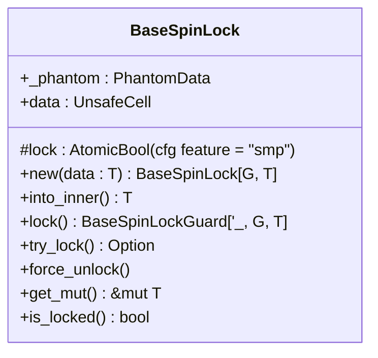
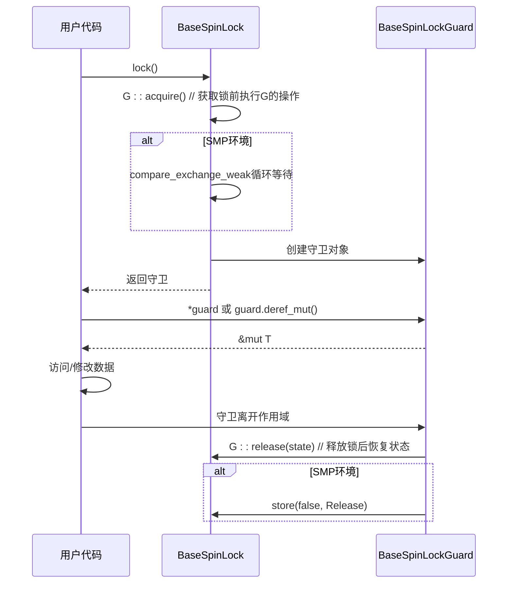

# API参考

<cite>
**Referenced Files in This Document**   
- [lib.rs](file://src/lib.rs)
- [base.rs](file://src/base.rs)
</cite>

## 目录
1. [简介](#简介)
2. [核心组件](#核心组件)
3. [BaseSpinLock 泛型接口与构造函数](#basespinlock-泛型接口与构造函数)
4. [BaseSpinLockGuard 的 Deref 与 DerefMut 实现](#basespinlockguard-的-deref-与-derefmut-实现)
5. [预定义类型别名详解](#预定义类型别名详解)
6. [安全契约（Safety Contracts）](#安全契约safety-contracts)
7. [公开项详细说明](#公开项详细说明)

## 简介
本文档为 `kspin` 库的所有公共API提供详尽的技术文档。该库实现了一个基于自旋锁（spin lock）的同步原语，专为内核环境设计。其核心是 `BaseSpinLock` 结构体，通过泛型参数控制在获取锁时对中断和抢占状态的操作。文档将深入解析其泛型接口、构造函数、锁方法的行为以及返回的守卫（guard）对象，并详细说明由其派生的预定义类型别名及其各自的语义和适用场景。

## 核心组件

本节分析 `kspin` 库的核心数据结构和算法。

**Section sources**
- [lib.rs](file://src/lib.rs#L1-L36)
- [base.rs](file://src/base.rs#L1-L437)

## BaseSpinLock 泛型接口与构造函数

`BaseSpinLock<G, T>` 是库中的核心结构体，它是一个泛型自旋锁，其中 `G` 是一个实现了 `BaseGuard` trait 的类型，用于定义获取和释放锁时对系统状态（如中断、抢占）的操作；`T` 是被保护的数据类型。

### new() 构造函数
`new()` 函数是一个常量函数（const fn），用于创建一个新的 `BaseSpinLock` 实例并包裹给定的数据。
- **函数签名**: `pub const fn new(data: T) -> Self`
- **参数说明**: `data` - 要被锁保护的初始数据。
- **返回值类型**: `Self`，即 `BaseSpinLock<G, T>` 的一个新实例。
- **线程安全性**: 该函数本身是线程安全的，因为它不涉及任何共享状态的修改。



**Diagram sources**
- [base.rs](file://src/base.rs#L15-L80)

**Section sources**
- [base.rs](file://src/base.rs#L49-L65)

## BaseSpinLockGuard 的 Deref 与 DerefMut 实现

当成功调用 `lock()` 或 `try_lock()` 方法后，会返回一个 `BaseSpinLockGuard<'a, G, T>` 类型的守卫对象。这个守卫对象实现了 `Deref` 和 `DerefMut` trait，从而允许用户像操作普通引用一样无缝地访问内部被保护的数据。

- **Deref 实现**: 允许通过 `*guard` 或 `guard.deref()` 来获取对内部数据 `T` 的不可变引用 `&T`。
- **DerefMut 实现**: 允许通过 `*guard` 或 `guard.deref_mut()` 来获取对内部数据 `T` 的可变引用 `&mut T`。

这种设计模式确保了在持有守卫期间可以安全地读写数据，并且当守卫离开作用域时，析构函数会自动释放锁，防止死锁。



**Diagram sources**
- [base.rs](file://src/base.rs#L150-L200)
- [base.rs](file://src/base.rs#L380-L400)

**Section sources**
- [base.rs](file://src/base.rs#L380-L400)

## 预定义类型别名详解

`kspin` 库通过 `type` 关键字定义了三个常用的类型别名，它们都是 `BaseSpinLock` 的特化版本，针对不同的使用场景提供了明确的语义。

### SpinNoPreempt<T>
- **语义差异**: 此锁在尝试获取时会禁用内核抢占（kernel preemption），并在解锁后重新启用。它必须在本地中断（IRQ）已禁用的上下文中使用，或者绝不能在中断处理程序中使用。
- **适用场景**: 适用于需要防止当前任务被其他任务抢占，但不关心中断状态的临界区。
- **源码示例**: `pub type SpinNoPreempt<T> = BaseSpinLock<NoPreempt, T>;`

### SpinNoIrq<T>
- **语义差异**: 此锁在尝试获取时会同时禁用内核抢占和本地中断（IRQ），并在解锁后重新启用两者。它可以安全地在中断使能的上下文中使用。
- **适用场景**: 适用于需要完全隔离中断和抢占的高优先级临界区，例如处理硬件中断共享的数据。
- **源码示例**: `pub type SpinNoIrq<T> = BaseSpinLock<NoPreemptIrqSave, T>;`

### SpinRaw<T>
- **语义差异**: 这是一个“裸”自旋锁，在尝试获取或释放时不做任何额外操作。使用者必须确保在调用前已经处于抢占和中断都已禁用的状态。
- **适用场景**: 适用于性能要求极高且调用者能严格保证上下文安全的底层代码。
- **源码示例**: `pub type SpinRaw<T> = BaseSpinLock<NoOp, T>;`

```mermaid
classDiagram
class BaseGuard
class NoPreempt
class NoPreemptIrqSave
class NoOp
class BaseSpinLock~G, T~
BaseGuard <|-- NoPreempt
BaseGuard <|-- NoPreemptIrqSave
BaseGuard <|-- NoOp
BaseSpinLock <|-- SpinNoPreempt
BaseSpinLock <|-- SpinNoIrq
BaseSpinLock <|-- SpinRaw
note right of BaseSpinLock
泛型参数G决定了锁的行为
end note
note right of SpinNoPreempt
使用NoPreempt作为G
禁用抢占
end note
note right of SpinNoIrq
使用NoPreemptIrqSave作为G
禁用抢占和中断
end note
note right of SpinRaw
使用NoOp作为G
不进行任何操作
end note
```

**Diagram sources**
- [lib.rs](file://src/lib.rs#L10-L30)

**Section sources**
- [lib.rs](file://src/lib.rs#L10-L30)

## 安全契约（Safety Contracts）

每个公开项都伴随着特定的安全契约，违反这些契约可能导致未定义行为（UB）。

- **裸指针解引用**: 在 `BaseSpinLockGuard` 的 `Deref` 和 `DerefMut` 实现中，使用了 `unsafe { &*self.data }` 和 `unsafe { &mut *self.data }`。这里的 `unsafe` 块是合理的，因为守卫的存在保证了对内部数据的独占访问权，符合Rust的借用规则。
- **中断状态保存**: 对于 `SpinNoIrq<T>`，`NoPreemptIrqSave` 在 `acquire()` 时会保存当前的中断状态，并在 `release()` 时将其恢复。这确保了锁的使用不会永久改变系统的中断使能状态，维护了系统的稳定性。

**Section sources**
- [base.rs](file://src/base.rs#L150-L200)
- [base.rs](file://src/base.rs#L400-L410)

## 公开项详细说明

以下表格列出了所有公开项的详细信息。

| 公开项 | 函数签名 | 参数说明 | 返回值类型 | 可能的 panic 条件 | 线程安全性 (Send/Sync) |
| :--- | :--- | :--- | :--- | :--- | :--- |
| BaseSpinLock::new | `pub const fn new(data: T) -> Self` | `data`: 要保护的数据 | `Self` (`BaseSpinLock<G, T>`) | 无 | `Send` 和 `Sync` 当 `T: Send` |
| BaseSpinLock::lock | `pub fn lock(&self) -> BaseSpinLockGuard<'_, G, T