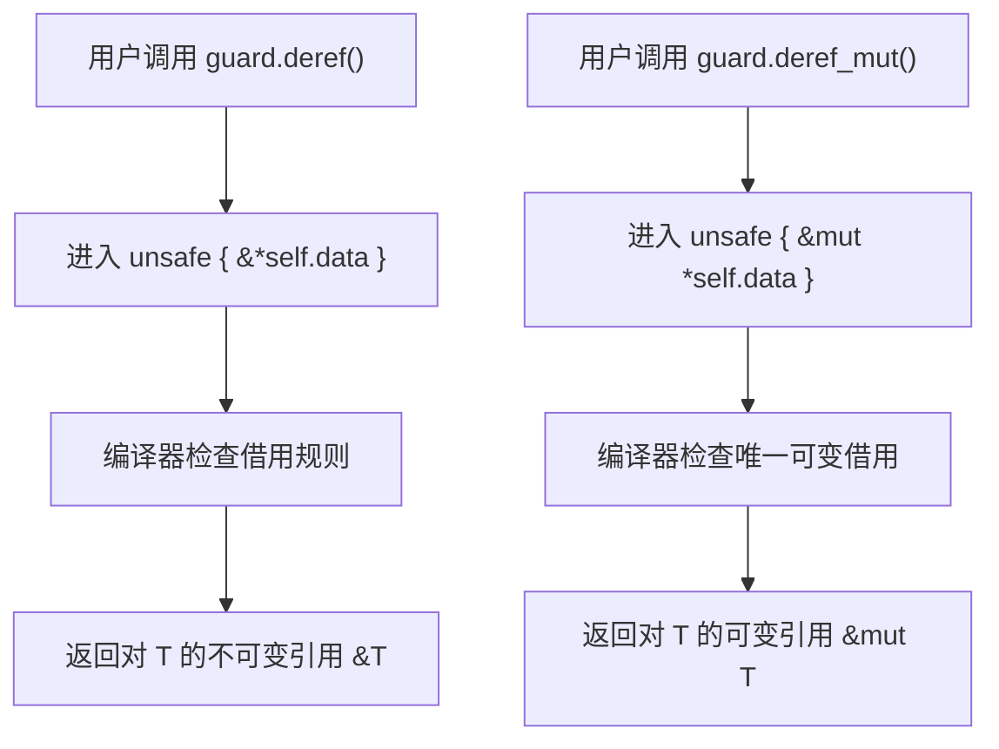
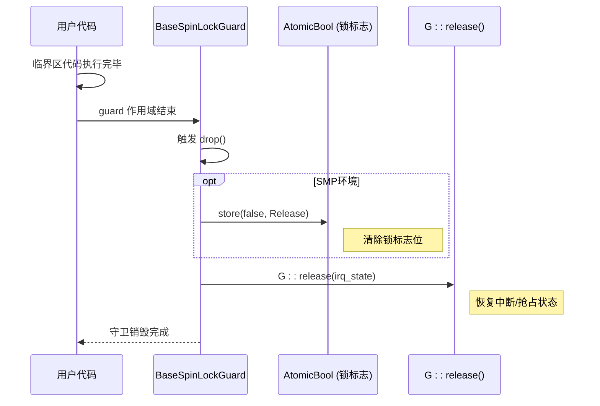
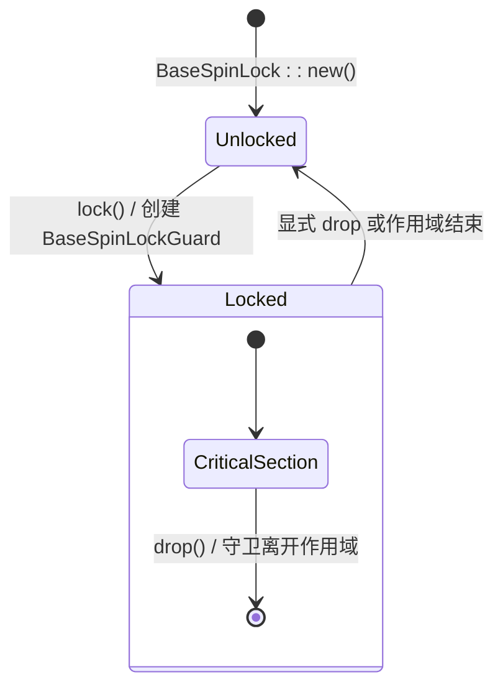

# BaseSpinLockGuard

<cite>
**本文档中引用的文件**
- [base.rs](file://src/base.rs)
- [lib.rs](file://src/lib.rs)
</cite>

## 目录
1. [简介](#简介)
2. [字段组成与内存布局](#字段组成与内存布局)
3. [Deref与DerefMut实现：安全解引用裸指针](#deref与derefmut实现安全解引用裸指针)
4. [Drop实现：自动释放锁与状态恢复](#drop实现自动释放锁与状态恢复)
5. [生命周期与安全模型](#生命周期与安全模型)
6. [使用示例：修改复杂结构体](#使用示例修改复杂结构体)

## 简介
`BaseSpinLockGuard` 是 `kspin` 库中为 `BaseSpinLock` 提供的 RAII（资源获取即初始化）守卫类型。它在构造时获取自旋锁，并在其作用域结束时通过 `Drop` 特性自动释放锁，确保了锁的正确释放，即使在发生 panic 的情况下也不会导致死锁。该守卫的设计核心是将锁的持有期与守卫对象的生命周期严格绑定，从而提供了一种安全、便捷的并发访问机制。

**Section sources**
- [base.rs](file://src/base.rs#L33-L42)

## 字段组成与内存布局
`BaseSpinLockGuard` 结构体由四个关键字段构成，每个字段都承担着特定的安全和功能职责：

1.  **`_phantom: &'a PhantomData<G>`**: 这是一个零大小的标记类型，用于在编译时携带泛型参数 `G` 的信息。由于 `G` 本身不包含任何运行时数据，但其行为（如是否禁用中断）对锁的安全性至关重要，`PhantomData` 确保了编译器能正确处理生命周期 `'a` 和类型 `G` 的关系，防止出现悬垂引用或类型混淆。
2.  **`irq_state: G::State`**: 此字段保存了在获取锁之前由 `G::acquire()` 方法所保存的中断或抢占状态。`G` 是一个实现了 `BaseGuard` 特性的类型（如 `NoPreemptIrqSave`），它负责在多核系统中管理底层的硬件状态。`irq_state` 记录了原始状态，以便在锁释放时精确地恢复。
3.  **`data: *mut T`**: 这是一个指向受保护数据的可变裸指针（raw pointer）。`BaseSpinLock` 内部使用 `UnsafeCell<T>` 来包裹数据，以允许在共享引用下进行内部可变性。守卫通过这个裸指针来访问被保护的数据。直接操作裸指针是不安全的，因此所有对 `data` 的访问都被封装在 `Deref` 和 `DerefMut` 的 `unsafe` 块中，由守卫的正确使用来保证安全性。
4.  **`lock: &'a AtomicBool` (仅在 "smp" 特性启用时)**: 在多核（SMP）环境下，此字段是对 `BaseSpinLock` 内部 `AtomicBool` 锁标志的引用。当守卫被丢弃时，`Drop` 实现会通过此引用来原子地清除锁标志位，向其他 CPU 核心表明锁已被释放。

这些字段共同构成了一个轻量级但功能完整的守卫，它不仅管理锁的状态，还管理着与锁相关的系统状态。

**Section sources**
- [base.rs](file://src/base.rs#L33-L42)

## Deref与DerefMut实现：安全解引用裸指针
`BaseSpinLockGuard` 通过实现 `Deref` 和 `DerefMut` 特性，为用户提供了对内部数据的透明访问。这使得守卫对象可以像普通引用一样被使用。



**Diagram sources**
- [base.rs](file://src/base.rs#L308-L327)

**Section sources**
- [base.rs](file://src/base.rs#L308-L327)

### 实现原理
- **`Deref` 实现**: 当用户对守卫执行解引用操作（如 `*guard` 或 `guard.field`）时，会调用 `deref(&self)` 方法。该方法返回一个 `&T` 类型的引用。其内部通过 `unsafe { &*self.data }` 将存储的裸指针 `*mut T` 转换为安全的不可变引用 `&T`。
- **`DerefMut` 实现**: 当需要可变访问时，会调用 `deref_mut(&mut self)` 方法。它同样使用 `unsafe { &mut *self.data }` 将裸指针转换为安全的可变引用 `&mut T`。

### 安全性保证
尽管转换过程使用了 `unsafe` 关键字，但这种用法是安全的，因为：
1.  **排他性访问**: 只有成功获取锁的线程才能创建 `BaseSpinLockGuard` 实例。这意味着在同一时刻，只有一个 `BaseSpinLockGuard` 持有对 `data` 的访问权。
2.  **RAII 生命周期**: 守卫的生命周期由编译器严格管理。只要守卫存在，锁就处于持有状态，确保了没有其他线程可以同时访问同一块数据。
3.  **封装**: 所有的 `unsafe` 操作都被限制在 `BaseSpinLockGuard` 的实现内部。库的使用者只需通过安全的 API（`lock()` 返回的守卫）进行操作，无需关心底层的 `unsafe` 细节。

## Drop实现：自动释放锁与状态恢复
`Drop` 特性的实现是 `BaseSpinLockGuard` 自动化的核心，它确保了锁和相关状态的可靠清理。



**Diagram sources**
- [base.rs](file://src/base.rs#L330-L339)

**Section sources**
- [base.rs](file://src/base.rs#L330-L339)

### 执行逻辑
当 `BaseSpinLockGuard` 对象离开其作用域时，Rust 运行时会自动调用其 `drop` 方法。该方法的执行顺序如下：
1.  **清除锁标志位 (仅 SMP)**: 在多核系统中，首先通过 `self.lock.store(false, Ordering::Release)` 原子地将锁的 `AtomicBool` 标志设置为 `false`。`Release` 内存序确保了在此之前的任何对受保护数据的写入操作，对于随后获取该锁的其他 CPU 核心都是可见的。
2.  **恢复中断/抢占状态**: 随后，调用泛型参数 `G` 的静态方法 `G::release(self.irq_state)`。这个方法接收之前保存的 `irq_state`，并将其作为参数，精确地恢复到获取锁之前的中断使能或内核抢占状态。

这个两步操作的顺序至关重要：必须先释放锁，再恢复中断。如果顺序颠倒，在恢复中断后、释放锁前的极短时间内，如果发生中断且中断处理程序尝试获取同一个锁，就会导致死锁。

## 生命周期与安全模型
`BaseSpinLockGuard` 的安全模型完全建立在 Rust 的所有权和生命周期系统之上。



**Diagram sources**
- [base.rs](file://src/base.rs#L330-L339)

**Section sources**
- [base.rs](file://src/base.rs#L330-L339)

### 核心原则
-   **生命周期绑定**: 守卫的生命周期 `'a` 与锁的持有期完全一致。只要守卫存在，锁就无法被其他线程获取；一旦守卫被销毁，锁立即可用。
-   **编译时检查**: Rust 编译器会强制执行借用规则。在一个作用域内，你只能拥有一个 `BaseSpinLockGuard` 的可变引用（`&mut`），这从根本上防止了数据竞争。
-   **零成本抽象**: 除了必要的原子操作外，`Deref` 和 `DerefMut` 的实现几乎没有运行时开销。对内部数据的访问被优化为直接的指针解引用。

这种设计将复杂的并发控制逻辑转化为简单的、由编译器保证的内存安全模式，极大地降低了编写并发代码的难度和出错风险。

## 使用示例：修改复杂结构体
以下示例展示了如何使用 `BaseSpinLockGuard` 在临界区内安全地修改一个复杂的结构体。

```rust
use kspin::{SpinNoIrq, SpinNoIrqGuard};

// 定义一个包含多个字段的复杂结构体
struct Counter {
    value: u32,
    max_value: u32,
    update_count: u32,
}

// 全局共享的受保护数据
static SHARED_COUNTER: SpinNoIrq<Counter> = SpinNoIrq::new(Counter {
    value: 0,
    max_value: 100,
    update_count: 0,
});

fn increment_counter() {
    // 获取锁，创建守卫。此时已进入临界区。
    let mut guard: SpinNoIrqGuard<Counter> = SHARED_COUNTER.lock();
    
    // 通过守卫安全地修改结构体字段
    if guard.value < guard.max_value {
        guard.value += 1;
        guard.update_count += 1; // 可以连续修改多个字段
    }
    
    // 守卫 `guard` 在此处离开作用域
    // 自动触发 `Drop`：1. 释放自旋锁 2. 恢复