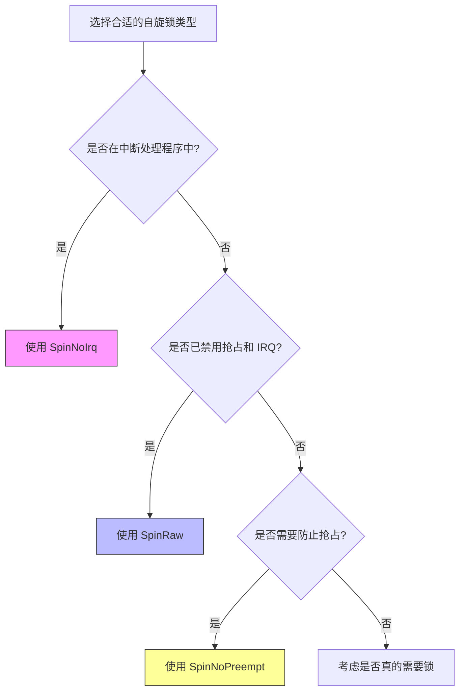

# 预定义类型别名

<cite>
**Referenced Files in This Document**  
- [lib.rs](file://src/lib.rs)
- [base.rs](file://src/base.rs)
</cite>

## 目录
1. [简介](#简介)
2. [核心类型别名详解](#核心类型别名详解)
3. [适用场景对比](#适用场景对比)
4. [API 易用性分析](#api-易用性分析)

## 简介
本文档系统化地文档化 `kspin` 库中定义的三个公共类型别名：`SpinNoPreempt<T>`、`SpinNoIrq<T>` 和 `SpinRaw<T>`。这些别名基于通用的 `BaseSpinLock<G, T>` 构造，通过指定不同的守卫（Guard）类型来提供不同级别的并发保护机制。它们的设计旨在简化内核环境中对共享数据的访问控制，同时确保在各种执行上下文中的安全性。

**Section sources**
- [lib.rs](file://src/lib.rs#L1-L36)

## 核心类型别名详解

### SpinNoPreempt<T>
`SpinNoPreempt<T>` 是一个自旋锁类型别名，它使用 `NoPreempt` 守卫。该守卫在尝试获取锁时会禁用内核抢占，并在释放锁后重新启用抢占。

此锁必须在本地中断（IRQ）已禁用的上下文中使用，或者永远不要在中断处理程序中使用，因为它不处理中断屏蔽。

**实际声明签名：**
```rust
pub type SpinNoPreempt<T> = BaseSpinLock<NoPreempt, T>;
```

**Section sources**
- [lib.rs](file://src/lib.rs#L10-L15)

### SpinNoIrq<T>
`SpinNoIrq<T>` 是一个自旋锁类型别名，它使用 `NoPreemptIrqSave` 守卫。该守卫在尝试获取锁时会同时禁用内核抢占和本地中断（IRQ），并保存当前的中断状态；在释放锁时恢复之前的中断状态。

此锁可以在 IRQ 启用的上下文中安全使用，适用于需要防止中断干扰的临界区。

**实际声明签名：**
```rust
pub type SpinNoIrq<T> = BaseSpinLock<NoPreemptIrqSave, T>;
```

**Section sources**
- [lib.rs](file://src/lib.rs#L20-L25)

### SpinRaw<T>
`SpinRaw<T>` 是一个原始自旋锁类型别名，它使用 `NoOp` 守卫。该守卫在获取和释放锁时不进行任何状态变更操作。

此锁必须在已经禁用了抢占和本地中断的上下文中使用，或者永远不要在中断处理程序中使用。它适用于已知无并发风险的单线程内核路径，提供了最低开销的锁定机制。

**实际声明签名：**
```rust
pub type SpinRaw<T> = BaseSpinLock<NoOp, T>;
```

**Section sources**
- [lib.rs](file://src/lib.rs#L30-L35)

## 适用场景对比

| 类型别名 | 守卫行为 | 适用场景 | 安全要求 |
|--------|---------|---------|---------|
| **SpinNoPreempt<T>** | 仅禁用内核抢占 | 在非中断上下文且不需要处理硬件中断的共享数据访问 | 必须在 IRQ 已禁用的上下文中使用 |
| **SpinNoIrq<T>** | 同时禁用抢占和本地 IRQ 并保存状态 | 中断处理程序或可能被中断打断的共享数据访问 | 可在 IRQ 启用的上下文中安全使用 |
| **SpinRaw<T>** | 不进行任何状态变更 | 已知无并发风险的单线程内核路径，如初始化代码或特定 CPU 上下文 | 必须在抢占和 IRQ 均已禁用的上下文中使用 |



**Diagram sources**
- [lib.rs](file://src/lib.rs#L10-L35)

## API 易用性分析

这三个预定义的类型别名通过组合基础组件显著提升了 API 的易用性：

1. **语义清晰化**：每个别名的名称直接反映了其行为特征（如 `NoPreempt`、`NoIrq`、`Raw`），使开发者能够直观理解其用途和限制。
2. **减少错误**：通过封装复杂的泛型参数（`BaseSpinLock<G, T>`），避免了用户手动指定守卫类型的潜在错误。
3. **提高可读性**：代码中直接使用 `SpinNoIrq<Data>` 比 `BaseSpinLock<NoPreemptIrqSave, Data>` 更加简洁明了。
4. **促进最佳实践**：为常见使用模式提供了标准化的解决方案，鼓励开发者根据具体场景选择最合适的锁类型。

这种设计体现了“约定优于配置”的原则，既保持了底层实现的灵活性，又为上层应用提供了简单、安全的接口。

**Section sources**
- [lib.rs](file://src/lib.rs#L10-L35)
- [base.rs](file://src/base.rs#L1-L437)