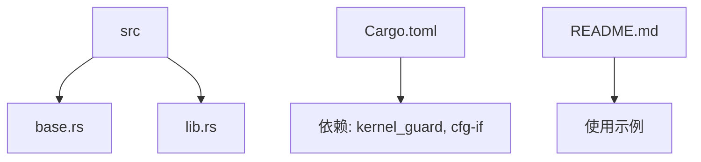
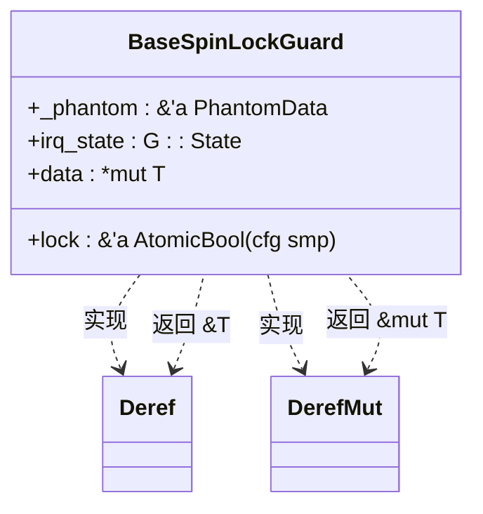
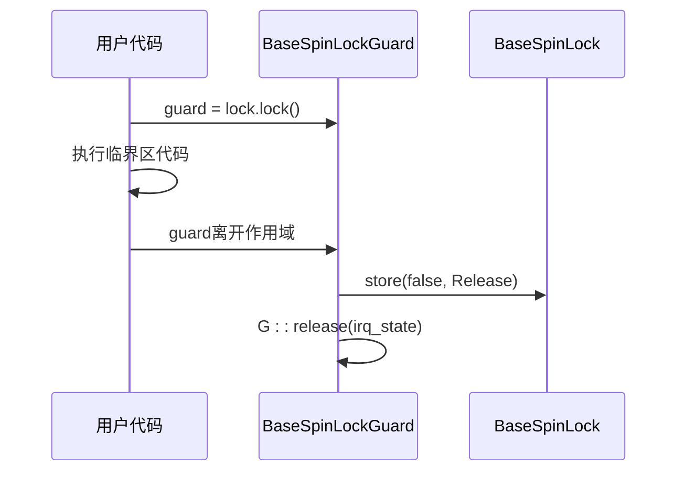

# RAII模式

<cite>
**本文档引用的文件**
- [base.rs](file://src/base.rs)
- [lib.rs](file://src/lib.rs)
- [Cargo.toml](file://Cargo.toml)
- [README.md](file://README.md)
</cite>

## 目录
1. [引言](#引言)
2. [项目结构](#项目结构)
3. [核心组件](#核心组件)
4. [RAII机制详解](#raii机制详解)
5. [BaseSpinLockGuard的Deref与DerefMut实现](#basespinlockguard的deref与derefmut实现)
6. [Drop机制与锁的自动释放](#drop机制与锁的自动释放)
7. [UnsafeCell与unsafe代码块的应用](#unsafecell与unsafe代码块的应用)
8. [实际使用示例与异常安全](#实际使用示例与异常安全)
9. [结论](#结论)

## 引言
本文深入分析Rust中RAII（资源获取即初始化）模式在`kspin`库中的具体实现。重点探讨`BaseSpinLockGuard`如何通过实现`Deref`和`DerefMut` trait，使用户能够像操作普通引用一样安全地访问被保护的数据。同时说明`Drop` trait如何确保锁在作用域结束时自动释放，防止死锁的发生。结合`base.rs`中的实现，展示`unsafe`代码块中对`UnsafeCell`的解引用过程，并解释该设计如何在保证安全性的同时兼顾性能。

## 项目结构
`kspin`是一个用于内核空间的自旋锁库，支持在临界区禁用抢占或中断。其项目结构简洁明了，主要由`src/base.rs`和`src/lib.rs`构成，其中`base.rs`定义了核心的自旋锁逻辑，而`lib.rs`则基于此构建了不同行为的类型别名。



**图示来源**
- [base.rs](file://src/base.rs#L1-L436)
- [lib.rs](file://src/lib.rs#L1-L36)

**本节来源**
- [base.rs](file://src/base.rs#L1-L436)
- [lib.rs](file://src/lib.rs#L1-L36)
- [Cargo.toml](file://Cargo.toml#L1-L21)
- [README.md](file://README.md#L1-L35)

## 核心组件
`kspin`的核心是`BaseSpinLock<G, T>`和`BaseSpinLockGuard<'a, G, T>`两个泛型结构体。前者封装了需要保护的数据，后者则是RAII机制的关键——锁守卫。通过泛型参数`G`（必须实现`BaseGuard` trait），可以控制在加锁时是否禁用中断或抢占，从而适应单核与多核环境。

**本节来源**
- [base.rs](file://src/base.rs#L17-L31)
- [base.rs](file://src/base.rs#L33-L42)

## RAII机制详解
RAII是Rust内存安全的基石之一。在`kspin`中，当调用`lock()`方法时，会返回一个`BaseSpinLockGuard`实例。该实例在栈上创建，其生命周期与当前作用域绑定。只要守卫存在，锁就保持持有状态；一旦守卫离开作用域（无论是正常执行还是因panic提前退出），其`Drop`实现将自动释放锁，从而确保资源不会泄漏。

这种机制消除了手动调用解锁函数的需要，从根本上防止了死锁的发生。

**本节来源**
- [base.rs](file://src/base.rs#L90-L180)

## BaseSpinLockGuard的Deref与DerefMut实现
为了使用户能够自然地访问被保护的数据，`BaseSpinLockGuard`实现了`Deref`和`DerefMut` trait。



**图示来源**
- [base.rs](file://src/base.rs#L195-L209)

**本节来源**
- [base.rs](file://src/base.rs#L195-L209)

### Deref实现
```rust
impl<G: BaseGuard, T: ?Sized> Deref for BaseSpinLockGuard<'_, G, T> {
    type Target = T;
    fn deref(&self) -> &T {
        unsafe { &*self.data }
    }
}
```
通过`Deref`，用户可以直接对守卫进行解引用操作，获得对内部数据的不可变引用。

### DerefMut实现
```rust
impl<G: BaseGuard, T: ?Sized> DerefMut for BaseSpinLockGuard<'_, G, T> {
    fn deref_mut(&mut self) -> &mut T {
        unsafe { &mut *self.data }
    }
}
```
`DerefMut`允许获得可变引用，使得可以在临界区内修改数据。

## Drop机制与锁的自动释放
`Drop` trait的实现是RAII自动释放资源的核心。



**图示来源**
- [base.rs](file://src/base.rs#L218-L230)

**本节来源**
- [base.rs](file://src/base.rs#L218-L230)

### Drop实现
```rust
impl<G: BaseGuard, T: ?Sized> Drop for BaseSpinLockGuard<'_, G, T> {
    fn drop(&mut self) {
        #[cfg(feature = "smp")]
        self.lock.store(false, Ordering::Release);
        G::release(self.irq_state);
    }
}
```
当守卫被销毁时，首先在SMP环境下将锁状态设为`false`，然后调用`G::release`恢复中断或抢占状态。这一过程是自动且确定性的，即使发生panic也不会被跳过。

## UnsafeCell与unsafe代码块的应用
由于`BaseSpinLock<T>`需要在多个线程间共享可变数据，它使用`UnsafeCell<T>`来包裹数据。`UnsafeCell`是Rust中实现内部可变性的基础类型，允许在共享引用下进行可变操作。

在`lock()`和`try_lock()`方法中，通过`unsafe { &mut *self.data.get() }`获取对内部数据的可变指针。这里的`unsafe`是合理的，因为：
1. 锁机制保证了同一时间只有一个线程能获取到有效的守卫；
2. 守卫的生命周期管理确保了引用的有效性；
3. `Drop`的自动调用保证了锁的及时释放。

**本节来源**
- [base.rs](file://src/base.rs#L96)
- [base.rs](file://src/base.rs#L141)
- [base.rs](file://src/base.rs#L173)

## 实际使用示例与异常安全
根据`README.md`中的示例，用户可以通过不同的类型别名选择合适的锁：

```rust
use kspin::{SpinNoIrq, SpinNoPreempt, SpinRaw};

let data = SpinRaw::new(());
let mut guard = data.lock();
/* 临界区，加锁时不进行任何操作 */
drop(guard);

let data = SpinNoPreempt::new(());
let mut guard = data.lock();
/* 临界区，禁用抢占 */
drop(guard);

let data = SpinNoIrq::new(());
let mut guard = data.lock();
/* 临界区，同时禁用抢占和中断 */
drop(guard);
```

更重要的是，即使在临界区内发生panic，`Drop`也会被调用，确保锁被释放。这一点在`base.rs`的测试用例`test_mutex_arc_access_in_unwind`中得到了验证。

**本节来源**
- [README.md](file://README.md#L20-L35)
- [base.rs](file://src/base.rs#L300-L315)

## 结论
`kspin`库通过精巧的RAII设计，将复杂的同步原语封装成简单易用的接口。`BaseSpinLockGuard`利用`Deref`/`DerefMut`提供透明的数据访问，通过`Drop`确保锁的自动释放，结合`UnsafeCell`在`unsafe`块中实现高效的内部可变性。这种设计在保证类型安全和内存安全的同时，达到了接近C语言的性能水平，充分体现了Rust在系统编程领域的优势。