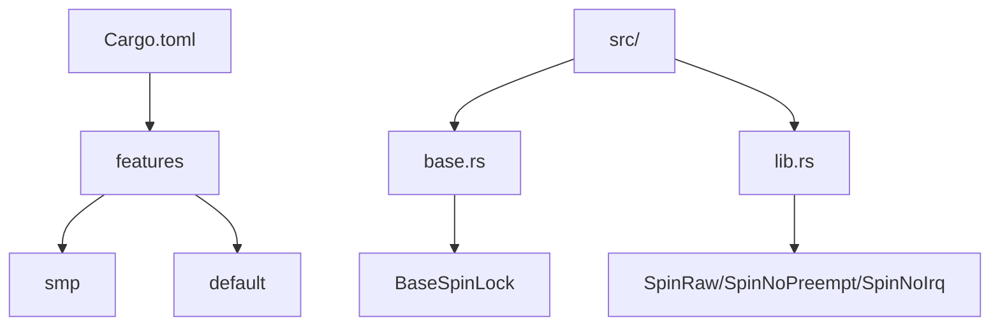
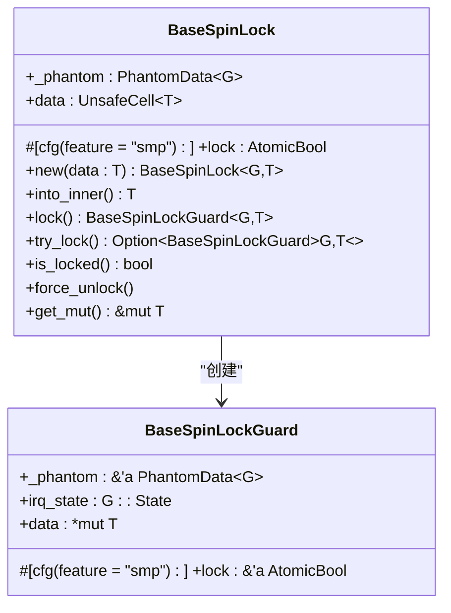

# 条件编译优化

<cite>
**Referenced Files in This Document**   
- [base.rs](file://src/base.rs)
- [lib.rs](file://src/lib.rs)
- [Cargo.toml](file://Cargo.toml)
- [README.md](file://README.md)
</cite>

## 目录
1. [引言](#引言)
2. [项目结构与特性配置](#项目结构与特性配置)
3. [核心组件分析](#核心组件分析)
4. [SMP特性的条件编译机制](#smp特性的条件编译机制)
5. [单核与多核环境下的性能差异](#单核与多核环境下的性能差异)
6. [编译器优化与机器码生成](#编译器优化与机器码生成)
7. [用户使用指南](#用户使用指南)
8. [性能对比建议](#性能对比建议)

## 引言

本文档系统阐述了kspin库中基于`#[cfg(feature = "smp")]`的条件编译机制，重点分析其在性能优化中的关键作用。通过深入解析源代码实现，展示该库如何根据目标平台（单核UP或多核SMP）智能地调整同步原语的行为，从而在保证正确性的同时最大化运行时效率。

## 项目结构与特性配置

kspin库采用标准Rust项目布局，核心逻辑位于`src/base.rs`，公共接口定义于`src/lib.rs`，构建配置由`Cargo.toml`管理。



**Diagram sources**
- [Cargo.toml](file://Cargo.toml#L1-L20)
- [lib.rs](file://src/lib.rs#L1-L36)

**Section sources**
- [Cargo.toml](file://Cargo.toml#L1-L20)
- [lib.rs](file://src/lib.rs#L1-L36)

## 核心组件分析

kspin的核心是`BaseSpinLock<G, T>`泛型结构体，它通过类型参数`G`（实现`BaseGuard` trait）来控制获取锁时的底层行为，如是否禁用抢占或中断。

### BaseSpinLock 结构体

`BaseSpinLock`的设计体现了高度的灵活性和可组合性。其内部包含一个`data: UnsafeCell<T>`用于存储受保护的数据，以及一个可选的`lock: AtomicBool`字段，后者的存在与否完全由`"smp"`特性决定。



**Diagram sources**
- [base.rs](file://src/base.rs#L25-L40)

**Section sources**
- [base.rs](file://src/base.rs#L25-L40)

## SMP特性的条件编译机制

`#[cfg(feature = "smp")]`是kspin实现环境自适应的关键。该属性宏指导编译器根据是否启用`smp`特性来有条件地包含或排除特定代码段。

### 特性声明与默认状态

在`Cargo.toml`中，`smp`特性被明确定义为用于多核环境，并且默认处于禁用状态。

```toml
[features]
# To use in the multi-core environment
smp = []
default = []
```

这意味着，在默认构建配置下，kspin假定运行环境为单核（UP），并据此进行激进的优化。

**Section sources**
- [Cargo.toml](file://Cargo.toml#L14-L16)

### 条件编译的具体应用

`base.rs`文件中广泛使用了`#[cfg(feature = "smp")]`来控制原子操作的引入：

1.  **结构体字段**：`lock: AtomicBool`字段仅在启用`smp`时存在。
2.  **方法实现**：`lock()`、`try_lock()`、`is_locked()`等方法的核心逻辑通过`cfg_if!`宏在SMP和UP模式间切换。
3.  **资源释放**：`Drop`实现中，`store(false)`操作同样被条件化。

这种细粒度的控制确保了在UP环境下，所有与跨CPU同步相关的开销都被彻底消除。

**Section sources**
- [base.rs](file://src/base.rs#L12-L341)
- [Cargo.toml](file://Cargo.toml#L14-L16)

## 单核与多核环境下的性能差异

kspin对UP和SMP环境采取了截然不同的处理策略，这直接导致了显著的性能差异。

### 多核（SMP）环境

当启用`smp`特性时，kspin提供完整的自旋锁语义：
-   **原子操作**：使用`AtomicBool`和`compare_exchange_weak`等原子指令，确保在多个CPU核心间的内存可见性和操作的原子性。
-   **忙等待**：在锁被占用时，线程会执行`core::hint::spin_loop()`进行忙等待，直到锁可用。
-   **内存序**：严格遵守`Acquire`和`Release`内存序，防止指令重排带来的数据竞争。

### 单核（UP）环境

在未启用`smp`特性的单核环境中，kspin进行了极致的优化：
-   **无锁状态**：`lock`字段被完全移除，不消耗任何内存空间。
-   **零开销获取**：`lock()`和`try_lock()`方法中的循环和原子操作被编译器完全优化掉，获取锁的操作变成一个简单的函数调用。
-   **简化逻辑**：`is_locked()`始终返回`false`，因为在一个没有并发的环境中，锁的状态是冗余信息。

这种设计哲学基于一个关键假设：在单核系统中，只要通过`BaseGuard`（如禁用抢占）确保了临界区不会被中断，那么就不会发生真正的并发访问，因此复杂的锁协议是不必要的。

**Section sources**
- [base.rs](file://src/base.rs#L102-L135)
- [base.rs](file://src/base.rs#L70-L100)
- [README.md](file://README.md#L9-L13)

## 编译器优化与机器码生成

`#[cfg(feature = "smp")]`机制使得Rust编译器能够为不同目标平台生成最优的机器码。

### UP环境的代码生成

在UP构建中，由于`cfg!(feature = "smp")`为`false`，编译器会：
1.  完全剥离`AtomicBool`相关的代码。
2.  将`lock()`方法内联后，其核心逻辑简化为调用`G::acquire()`和构造`BaseSpinLockGuard`。
3.  生成的机器码不包含任何原子指令（如`lock cmpxchg`），避免了总线锁定的高昂代价。

### SMP环境的代码生成

在SMP构建中，编译器会保留并优化完整的原子操作序列，生成包含`cmpxchg`等指令的机器码，以确保跨核心的一致性。

这种“静态决策”优于“运行时分支”，因为它消除了每次加锁/解锁时的条件判断开销，将性能优化提升到了编译期。

**Section sources**
- [base.rs](file://src/base.rs#L70-L100)
- [base.rs](file://src/base.rs#L102-L135)

## 用户使用指南

开发者应根据目标硬件平台正确配置`smp`特性。

### 启用SMP特性

对于多核系统，应在`Cargo.toml`中显式启用`smp`特性：

```toml
[dependencies]
kspin = { version = "0.1.1", features = ["smp"] }
```

或者在构建命令中指定：
```bash
cargo build --features smp
```

### 禁用SMP特性（默认）

对于单核系统，无需任何额外配置，使用默认依赖即可获得最佳性能。

### 接口选择

kspin提供了三种预定义的锁类型，用户应根据临界区的需求选择：
-   `SpinRaw<T>`：最轻量级，假设调用者已禁用抢占和中断。
-   `SpinNoPreempt<T>`：在获取锁时自动禁用内核抢占。
-   `SpinNoIrq<T>`：在获取锁时自动禁用本地中断和抢占。

这些类型都基于`BaseSpinLock`，其行为随`smp`特性的开关而变化。

**Section sources**
- [Cargo.toml](file://Cargo.toml#L14-L16)
- [lib.rs](file://src/lib.rs#L10-L36)
- [README.md](file://README.md#L15-L35)

## 性能对比建议

为了充分理解不同配置的实际影响，建议进行以下对比测试：

1.  **基准测试**：使用`criterion`等工具，分别在启用和禁用`smp`特性的情况下，测量`lock()`和`unlock()`操作的平均延迟。
2.  **内存占用**：比较两种构建下`BaseSpinLock<()>`实例的大小（`std::mem::size_of::<BaseSpinLock<NoOp, ()>>()`）。UP版本应比SMP版本小一个`AtomicBool`的大小。
3.  **汇编分析**：使用`cargo asm`工具查看`lock()`方法生成的汇编代码，直观地观察UP版本中原子指令的缺失。
4.  **真实场景压力测试**：在模拟的高并发场景下（即使是在单核上通过中断模拟并发），测试系统的整体吞吐量和响应时间。

通过这些测试，开发者可以量化条件编译带来的性能收益，并验证其在特定应用场景下的有效性。