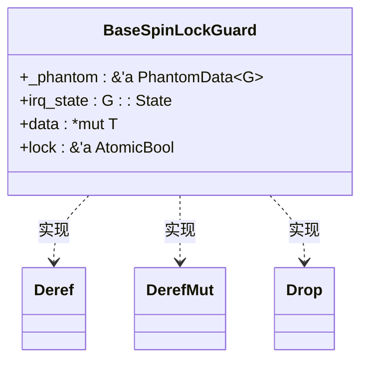
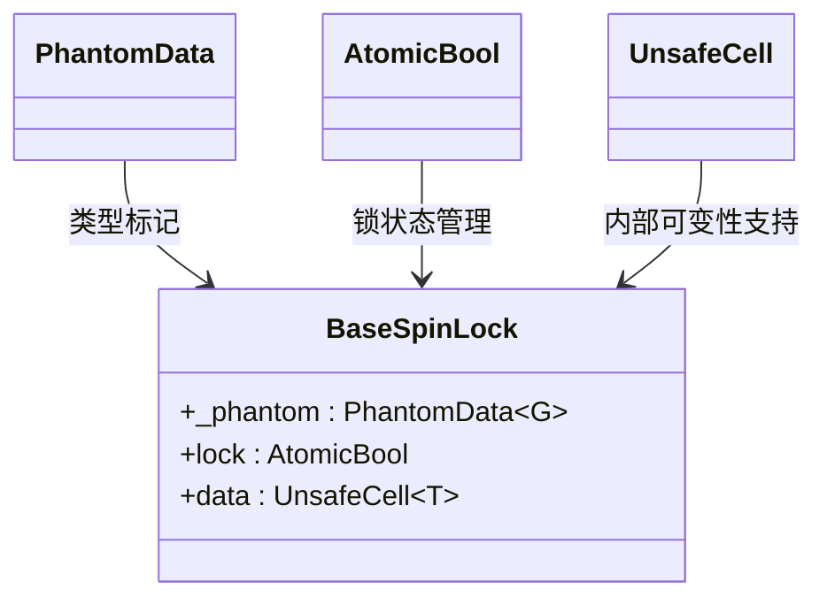

# 核心概念

<cite>
**本文档中引用的文件**  
- [base.rs](file://src/base.rs)
- [lib.rs](file://src/lib.rs)
- [README.md](file://README.md)
</cite>

## 目录
1. [自旋锁基本原理](#自旋锁基本原理)  
2. [RAII模式与BaseSpinLockGuard实现](#raii模式与basespinlockguard实现)  
3. [泛型参数G: BaseGuard的设计意义](#泛型参数g-baseguard的设计意义)  
4. [PhantomData、UnsafeCell与AtomicBool的作用](#phantomdataunsafecell与atomicbool的作用)  
5. [compare_exchange_weak循环逻辑分析](#compare_exchangeweak循环逻辑分析)  
6. [单核环境下的条件编译优化](#单核环境下的条件编译优化)

## 自旋锁基本原理

自旋锁是一种简单的互斥同步机制，其核心思想是：当线程尝试获取已被占用的锁时，并不会立即进入休眠或阻塞状态，而是持续轮询（“自旋”）检查锁的状态，直到成功获取为止。这种机制在高并发内核环境中具有低延迟的优势，因为避免了上下文切换的开销。

然而，自旋锁的代价在于CPU资源的浪费——在锁被长时间持有时，等待线程会持续占用CPU进行无效循环，导致性能下降甚至系统资源耗尽。因此，自旋锁适用于临界区执行时间极短的场景，尤其在操作系统内核等对响应时间要求极高的环境中。

在`kspin`库中，`BaseSpinLock`结构体实现了这一机制。对于多核（SMP）环境，通过`AtomicBool`类型的`lock`字段标记锁状态；而在单核环境下，由于无需考虑并发竞争，该字段会被编译器优化移除。

**Section sources**  
- [base.rs](file://src/base.rs#L0-L42)
- [README.md](file://README.md#L1-L35)

## RAII模式与BaseSpinLockGuard实现

RAII（Resource Acquisition Is Initialization，资源获取即初始化）是C++和Rust中一种重要的资源管理范式，其核心思想是将资源的生命周期与对象的生命周期绑定：资源在对象构造时获取，在对象析构时自动释放。

在Rust中，`Drop` trait提供了析构能力，使得RAII得以安全实现。`kspin`库中的`BaseSpinLockGuard<'a, G, T>`正是这一模式的典型应用。当调用`BaseSpinLock::lock()`方法时，返回一个`BaseSpinLockGuard`守卫对象，该对象在栈上创建并持有对锁的引用。一旦守卫离开作用域（如函数结束或显式调用`drop`），其`Drop`实现会自动释放锁，从而保证即使发生panic也能正确解锁，防止死锁。

此外，通过实现`Deref`和`DerefMut` trait，`BaseSpinLockGuard`能够透明地解引用为内部数据的不可变和可变引用，使用户可以像操作普通引用一样访问受保护的数据，极大地提升了使用体验和代码可读性。



**Diagram sources**  
- [base.rs](file://src/base.rs#L177-L216)
- [base.rs](file://src/base.rs#L218-L275)

**Section sources**  
- [base.rs](file://src/base.rs#L177-L216)
- [base.rs](file://src/base.rs#L218-L275)

## 泛型参数G: BaseGuard的设计意义

`BaseSpinLock<G: BaseGuard, T: ?Sized>`中的泛型参数`G`是`kspin`设计灵活性的关键。它允许在获取和释放锁时执行不同的上下文操作，具体行为由`G`所实现的`BaseGuard` trait决定。

通过定义不同的守卫类型，可以在不同场景下控制中断和抢占状态：
- `NoOp`: 不进行任何操作，适用于已禁用抢占和中断的上下文中。
- `NoPreempt`: 在加锁时禁用内核抢占，解锁时恢复，用于防止任务切换。
- `NoPreemptIrqSave`: 在加锁时同时禁用抢占和本地中断，并保存中断状态，解锁时恢复原始状态，确保在中断上下文中也能安全使用。

这种设计通过组合而非继承的方式，实现了高度可复用且类型安全的锁机制。用户只需选择合适的守卫类型即可获得相应的同步语义，而无需修改锁本身的实现。

**Section sources**  
- [lib.rs](file://src/lib.rs#L0-L35)
- [base.rs](file://src/base.rs#L218-L275)

## PhantomData、UnsafeCell与AtomicBool的作用

### PhantomData
`PhantomData<G>`是一个零大小的标记类型，用于告诉编译器`BaseSpinLock`在逻辑上拥有对类型`G`的引用。尽管`_phantom`字段并未实际存储`G`的实例，但它影响了类型的生命周期和所有权规则，确保编译器能正确处理与`G`相关的借用检查。

### UnsafeCell
`UnsafeCell<T>`是Rust中实现内部可变性的基础。它允许在共享引用（`&T`）的情况下修改内部数据，绕过Rust默认的“同一时刻只能有唯一可变引用或多个不可变引用”的规则。`BaseSpinLock`使用`UnsafeCell<T>`包裹数据，使得多个线程可以通过`&self`调用`lock()`方法并获得对数据的可变访问权，这是实现互斥锁的前提。

### AtomicBool
在多核环境中，`AtomicBool`用于表示锁的占用状态（`true`表示已锁定，`false`表示空闲）。其原子性保证了在多处理器间对该状态的读写不会发生数据竞争。结合内存顺序（`Ordering::Acquire`和`Ordering::Release`），`AtomicBool`确保了锁操作的同步语义，防止指令重排带来的问题。



**Diagram sources**  
- [base.rs](file://src/base.rs#L0-L42)
- [base.rs](file://src/base.rs#L44-L68)

**Section sources**  
- [base.rs](file://src/base.rs#L0-L42)
- [base.rs](file://src/base.rs#L44-L68)

## compare_exchange_weak循环逻辑分析

在多核环境下，`lock()`方法通过`compare_exchange_weak`原子操作实现锁的获取。该操作尝试将`lock`从`false`（未锁定）更新为`true`（已锁定），若当前值确为`false`则更新成功并返回`Ok(旧值)`，否则失败返回`Err(当前值)`。

`weak`版本可能因硬件原因虚假失败（spurious failure），因此需在循环中重试。其典型模式如下：

```rust
while self.lock.compare_exchange_weak(false, true, Ordering::Acquire, Ordering::Relaxed).is_err() {
    while self.is_locked() {
        core::hint::spin_loop();
    }
}
```

外层循环持续尝试获取锁，内层循环在检测到锁仍被占用时调用`spin_loop()`提示CPU进行忙等待优化（如超线程调度）。这种双重循环设计平衡了性能与效率：`compare_exchange_weak`的潜在虚假失败被外层循环处理，而`is_locked()`的轻量级检查减少了不必要的原子操作次数。

**Section sources**  
- [base.rs](file://src/base.rs#L70-L100)

## 单核环境下的条件编译优化

`kspin`通过条件编译特性`feature = "smp"`实现了对单核环境的优化。当未启用`smp`特性时，所有与`AtomicBool`相关的字段和操作都会被完全移除。

例如：
- `lock: AtomicBool`字段仅在`#[cfg(feature = "smp")]`条件下存在。
- `is_locked()`方法在非SMP环境下直接返回`false`。
- `try_lock()`在非SMP环境下始终返回`Some(guard)`。

这意味着在单核系统中，`BaseSpinLock`退化为一个零成本抽象：加锁操作不再需要原子指令或循环等待，仅需调用`G::acquire()`保存上下文状态即可立即获得守卫。这不仅消除了自旋带来的CPU浪费，还显著提升了性能，体现了“零抽象成本”的Rust设计理念。

**Section sources**  
- [base.rs](file://src/base.rs#L102-L135)
- [README.md](file://README.md#L1-L35)