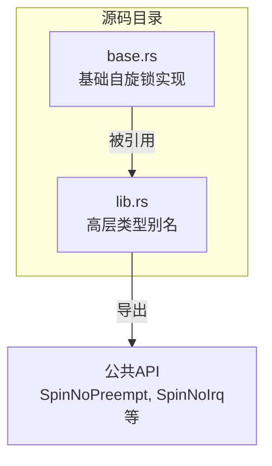
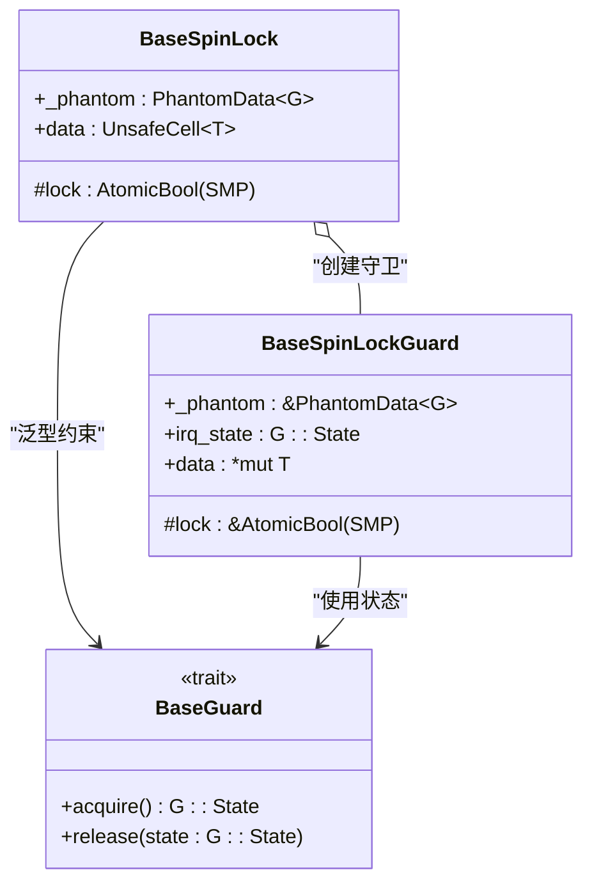
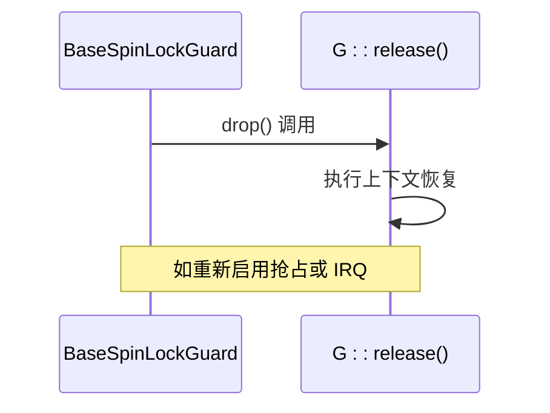
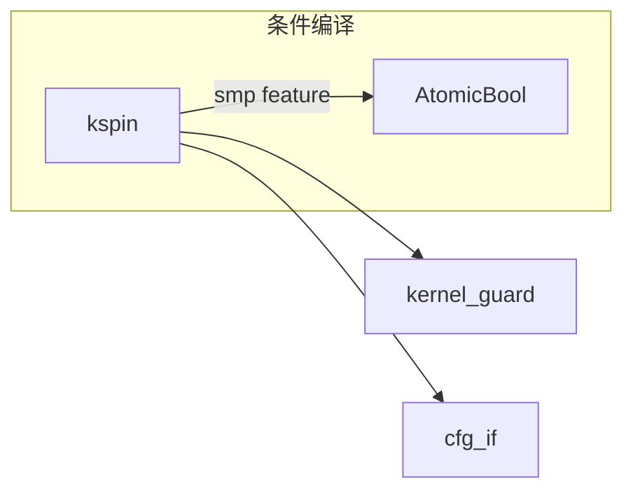

# 泛型策略

<cite>
**本文档中引用的文件**
- [base.rs](file://src/base.rs)
- [lib.rs](file://src/lib.rs)
- [Cargo.toml](file://Cargo.toml)
- [README.md](file://README.md)
</cite>

## 目录
1. [简介](#简介)
2. [项目结构](#项目结构)
3. [核心组件](#核心组件)
4. [架构概述](#架构概述)
5. [详细组件分析](#详细组件分析)
6. [依赖分析](#依赖分析)
7. [性能考虑](#性能考虑)
8. [故障排除指南](#故障排除指南)
9. [结论](#结论)

## 简介
`kspin` 是一个用于内核空间的自旋锁库，通过泛型参数 `G: BaseGuard` 实现灵活的中断与抢占控制机制。该设计允许开发者根据不同的执行上下文需求选择合适的守卫类型（如 `NoPreempt`、`NoPreemptIrqSave`），从而在单核或多核环境中安全地管理临界区。本文档将深入解析其基于泛型的设计模式，说明如何利用类型别名构建高层次抽象，并探讨此设计对编译时代码生成的影响。

## 项目结构
该项目采用典型的 Rust 库结构，包含基础实现模块和高层类型定义。通过分离通用逻辑与具体策略，实现了高度可复用且类型安全的同步原语。



**Diagram sources**
- [base.rs](file://src/base.rs#L1-L437)
- [lib.rs](file://src/lib.rs#L1-L36)

**Section sources**
- [base.rs](file://src/base.rs#L1-L437)
- [lib.rs](file://src/lib.rs#L1-L36)

## 核心组件
`BaseSpinLock<G, T>` 和 `BaseSpinLockGuard<'a, G, T>` 是本库的核心数据结构，分别表示带有守卫策略的自旋锁及其守卫。泛型参数 `G` 必须实现 `BaseGuard` trait，决定了获取和释放锁时的行为，例如是否禁用抢占或中断。

**Section sources**
- [base.rs](file://src/base.rs#L21-L68)
- [lib.rs](file://src/lib.rs#L7-L35)

## 架构概述
整个库的架构围绕策略模式展开：`BaseSpinLock` 提供通用的锁定机制，而具体的执行上下文控制由 `G` 参数指定的守卫类型完成。这种解耦使得可以在不修改核心逻辑的情况下扩展新的守卫行为。



**Diagram sources**
- [base.rs](file://src/base.rs#L21-L68)

## 详细组件分析

### BaseSpinLock 与 BaseSpinLockGuard 分析
`BaseSpinLock` 在调用 `lock()` 方法时首先调用 `G::acquire()` 来进入受保护的执行上下文（如禁用抢占），然后尝试原子性地获取锁。成功后返回一个 `BaseSpinLockGuard`，其中保存了 `G::acquire()` 返回的状态信息。当守卫超出作用域时，`Drop` 实现会调用 `G::release(self.irq_state)` 恢复之前的上下文状态。

#### 锁获取流程
```mermaid
flowchart TD
Start([开始 lock()]) --> AcquireGuard["调用 G::acquire()"]
AcquireGuard --> CheckLock{"是否为 SMP?"}
CheckLock --> |是| TryLock["循环 compare_exchange_weak"]
CheckLock --> |否| CreateGuard["直接创建守卫"]
TryLock --> |失败| WaitLoop["spin_loop() 并重试"]
TryLock --> |成功| CreateGuard["创建 BaseSpinLockGuard"]
CreateGuard --> End([返回守卫])
```

**Diagram sources**
- [base.rs](file://src/base.rs#L70-L100)

#### 守卫释放流程


**Diagram sources**
- [base.rs](file://src/base.rs#L218-L225)

**Section sources**
- [base.rs](file://src/base.rs#L70-L100)
- [base.rs](file://src/base.rs#L218-L225)

### 高层次类型别名分析
`lib.rs` 中定义了多个类型别名，将特定的守卫策略与 `BaseSpinLock` 组合，形成语义清晰的高层抽象：

| 类型别名 | 守卫类型 | 行为描述 |
|---------|--------|--------|
| `SpinNoPreempt<T>` | `NoPreempt` | 禁用内核抢占 |
| `SpinNoIrq<T>` | `NoPreemptIrqSave` | 同时禁用抢占和本地中断 |
| `SpinRaw<T>` | `NoOp` | 不进行任何上下文操作 |

这些别名简化了 API 使用，使开发者无需直接处理底层泛型细节即可选择合适的行为模式。

**Section sources**
- [lib.rs](file://src/lib.rs#L14-L35)

## 依赖分析
该库依赖于 `kernel_guard` crate 提供的 `BaseGuard` trait 及其实现（`NoOp`, `NoPreempt`, `NoPreemptIrqSave`）。此外，通过条件编译特征 `smp` 控制多核环境下的原子锁状态管理。



**Diagram sources**
- [Cargo.toml](file://Cargo.toml#L1-L22)
- [base.rs](file://src/base.rs#L15)

**Section sources**
- [Cargo.toml](file://Cargo.toml#L1-L22)
- [base.rs](file://src/base.rs#L15)

## 性能考虑
- **单核优化**：在非 SMP 环境下，锁状态被完全优化掉，仅保留数据本身，减少内存开销。
- **零成本抽象**：所有守卫操作均在编译期确定，运行时无虚函数调用开销。
- **忙等待**：采用自旋方式等待锁释放，适合短临界区，避免调度开销。

## 故障排除指南
- **死锁风险**：确保不在中断处理程序中使用需要禁用 IRQ 的锁（如 `SpinNoIrq`）。
- **上下文错误**：`SpinRaw` 必须在已禁用抢占和中断的上下文中使用，否则可能导致竞态。
- **SMP 编译问题**：若目标平台为单核，请确认未意外启用 `smp` 特征。

**Section sources**
- [README.md](file://README.md#L13-L35)
- [lib.rs](file://src/lib.rs#L14-L35)

## 结论
`kspin` 通过泛型参数化守卫策略的方式，实现了高度灵活且类型安全的自旋锁机制。开发者可以通过组合不同的 `BaseGuard` 实现来适应各种内核执行上下文需求。该设计不仅提升了代码复用性，还借助 Rust 的编译时特性保证了运行时效率，是策略模式在系统编程中的优秀实践范例。