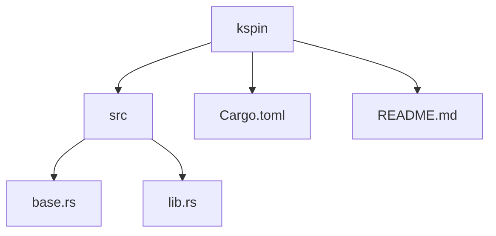
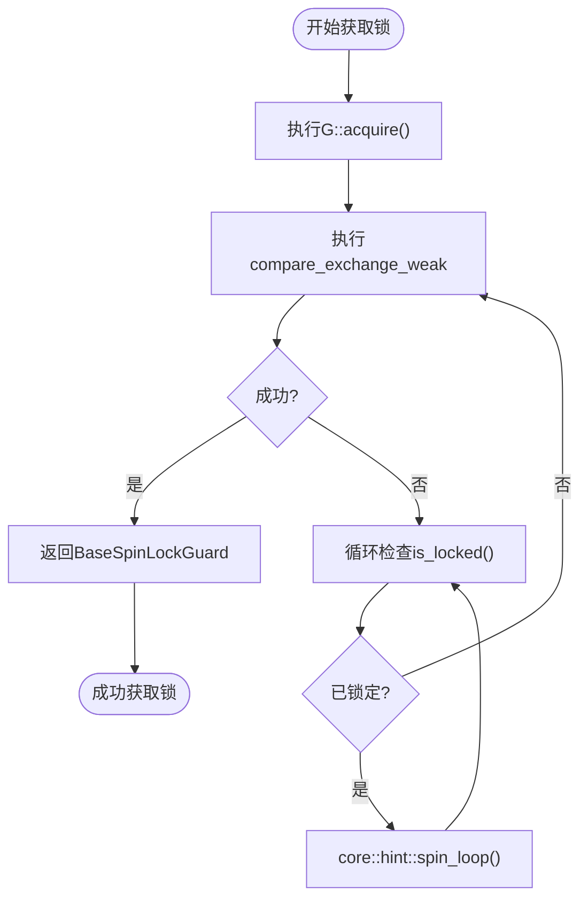
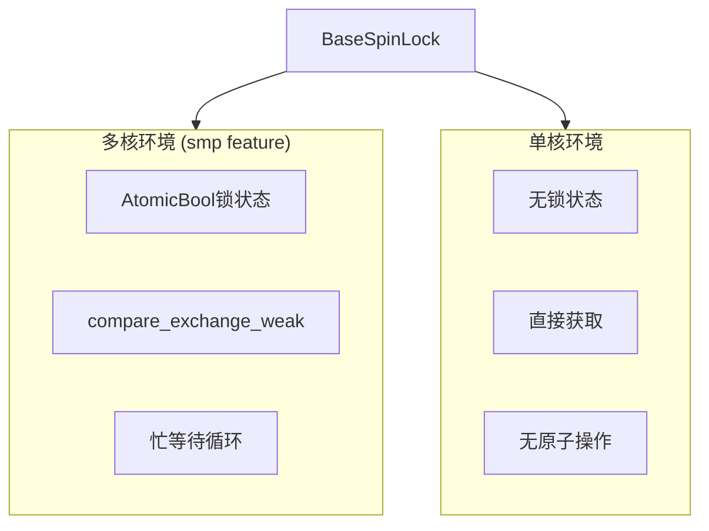

<cite>
**本文档中引用的文件**
- [base.rs](file://src/base.rs)
- [lib.rs](file://src/lib.rs)
- [README.md](file://README.md)
</cite>

## 目录
1. [引言](#引言)
2. [项目结构](#项目结构)
3. [核心组件](#核心组件)
4. [自旋锁工作机制分析](#自旋锁工作机制分析)
5. [多处理器环境下的工作方式](#多处理器环境下的工作方式)
6. [内存序选择的影响](#内存序选择的影响)
7. [适用场景与局限性](#适用场景与局限性)
8. [单核系统优化机制](#单核系统优化机制)
9. [结论](#结论)

## 引言

自旋锁是一种基础的内核同步原语，用于在多处理器环境中实现对临界区的互斥访问。本文档详细解释`BaseSpinLock`如何利用原子操作实现忙等待机制，并分析其在不同硬件环境下的行为特征和性能表现。

## 项目结构

该项目是一个轻量级的内核空间自旋锁实现，主要包含两个源文件和一个配置文件。

**Diagram sources**
- [base.rs](file://src/base.rs)
- [lib.rs](file://src/lib.rs)

**Section sources**
- [base.rs](file://src/base.rs)
- [lib.rs](file://src/lib.rs)
- [README.md](file://README.md)

## 核心组件

`BaseSpinLock`是该库的核心数据结构，通过泛型参数`G`（实现`BaseGuard` trait）来控制进入临界区前需要执行的保护操作，如禁用中断或内核抢占。`BaseSpinLockGuard`则作为RAII守卫，在作用域结束时自动释放锁并恢复系统状态。

**Section sources**
- [base.rs](file://src/base.rs#L28-L40)
- [lib.rs](file://src/lib.rs#L10-L35)

## 自旋锁工作机制分析

`BaseSpinLock`使用`AtomicBool`作为锁状态标志，初始值为`false`表示未锁定。当线程调用`lock()`方法时，会进入一个循环，不断尝试使用`compare_exchange_weak`原子操作将锁状态从`false`修改为`true`。如果当前锁已被其他线程持有（即状态为`true`），则操作失败，线程继续循环等待。

**Diagram sources**
- [base.rs](file://src/base.rs#L70-L100)

**Section sources**
- [base.rs](file://src/base.rs#L70-L100)

## 多处理器环境下的工作方式

在启用`smp`特性的多处理器环境下，`BaseSpinLock`的完整锁机制被激活。每个CPU核心上的线程都可以竞争同一个锁。当多个线程同时尝试获取锁时，只有一个线程能成功完成`compare_exchange_weak`操作，其余线程将进入忙等待状态。这种设计确保了即使在并发激烈的场景下也能保证数据的一致性和互斥性。

**Section sources**
- [base.rs](file://src/base.rs#L12)
- [README.md](file://README.md#L13-L15)

## 内存序选择的影响

`BaseSpinLock`在`compare_exchange_weak`操作中使用`Ordering::Acquire`作为成功时的内存序，这确保了在当前线程成功获取锁后，所有后续的内存读写操作不会被重排序到锁获取之前。而在释放锁时使用的`Ordering::Release`则保证了所有之前的内存操作都已完成并对其它处理器可见。这种Acquire-Release内存序配对对于维护正确的同步语义至关重要。

**Section sources**
- [base.rs](file://src/base.rs#L78)
- [base.rs](file://src/base.rs#L223)

## 适用场景与局限性

自旋锁适用于临界区执行时间短且争用不激烈的场景。其优点是避免了线程切换开销，具有较低的最佳情况延迟。然而，在高争用情况下，自旋锁会导致CPU资源浪费，因为等待线程会持续占用处理器进行无效循环。此外，不当使用可能导致优先级反转问题。

**Section sources**
- [base.rs](file://src/base.rs#L1-L5)
- [README.md](file://README.md#L13-L35)

## 单核系统优化机制

在单核系统中（未启用`smp`特性），编译器会通过条件编译完全移除`AtomicBool`锁状态和相关的原子操作。这是因为单核环境下只要遵循正确的守卫使用规范，就可以保证互斥性。这种优化消除了不必要的原子操作开销，提高了单核系统的运行效率。

**Diagram sources**
- [base.rs](file://src/base.rs#L12)
- [base.rs](file://src/base.rs#L111)

**Section sources**
- [base.rs](file://src/base.rs#L12)
- [base.rs](file://src/base.rs#L111)
- [README.md](file://README.md#L13-L15)

## 结论

`BaseSpinLock`提供了一个灵活高效的内核同步机制，通过结合原子操作、RAII守卫和条件编译技术，在不同硬件平台上实现了最优的性能表现。理解其内部工作原理有助于开发者正确选择和使用适当的同步原语，从而构建稳定可靠的并发程序。