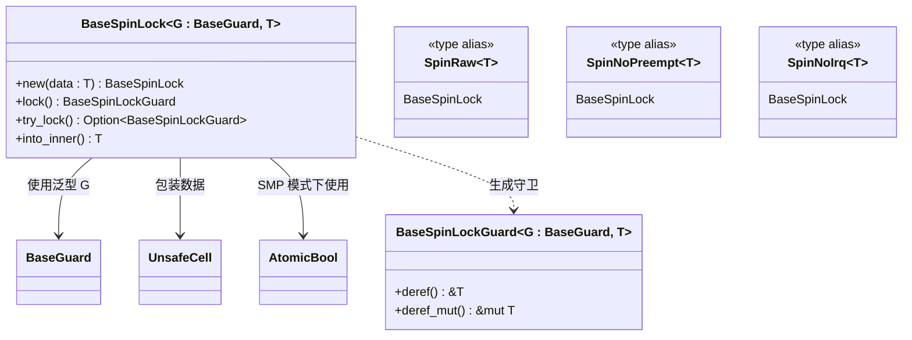
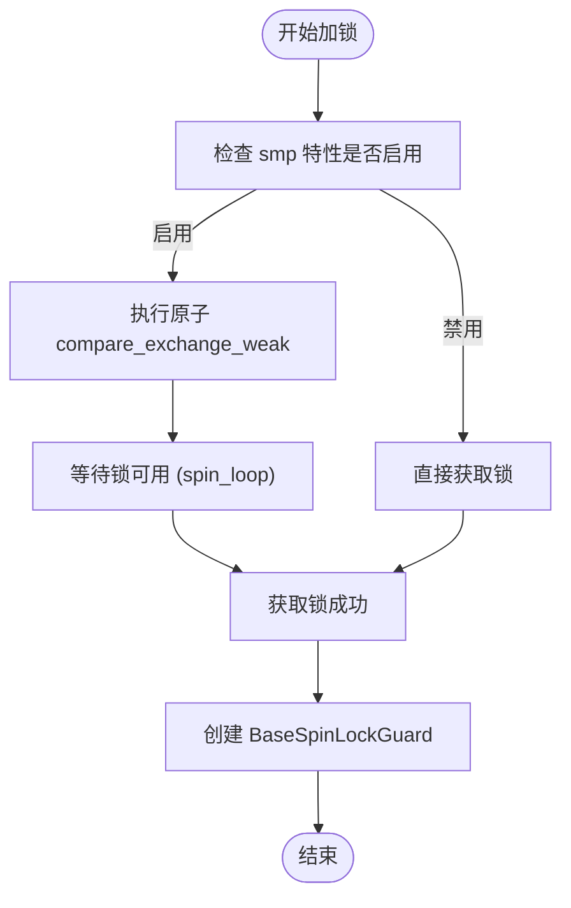

<cite>
**本文档引用的文件**
- [Cargo.toml](file://Cargo.toml)
- [src/base.rs](file://src/base.rs)
- [src/lib.rs](file://src/lib.rs)
- [README.md](file://README.md)
</cite>

## 目录
1. [简介](#简介)
2. [核心功能概述](#核心功能概述)
3. `smp` 特性详解
4. 配置与使用方法
5. 性能与兼容性分析
6. 编译结果对比
7. 未来扩展方向
8. 结论

## 简介

kspin 是一个专为内核空间设计的自旋锁库，能够在临界区中禁用抢占或中断（IRQ）。该库适用于操作系统内核开发场景，提供多种类型的自旋锁以适应不同的运行环境需求。其主要特点包括支持单核和多核系统的优化、灵活的防护机制以及零成本抽象。

本说明文档将重点介绍 kspin 的功能特性，特别是 `smp` 特性的实现原理及其对代码路径的影响，并指导用户如何根据目标平台进行合理配置。

**Section sources**
- [README.md](file://README.md#L1-L35)

## 核心功能概述

kspin 提供了基于 `BaseSpinLock` 的通用自旋锁结构，通过泛型参数 `G` 实现不同级别的保护策略。具体而言：

- **SpinRaw<T>**：原始自旋锁，在尝试加锁时不执行任何操作，必须在已禁用抢占和本地中断的上下文中使用。
- **SpinNoPreempt<T>**：在加锁时禁用内核抢占，解锁时重新启用。
- **SpinNoIrq<T>**：在加锁时同时禁用内核抢占和本地中断，解锁时恢复状态。

这些类型均基于 `BaseGuard` trait 构建，确保在进入临界区前采取适当的同步措施。



**Diagram sources**
- [src/lib.rs](file://src/lib.rs#L1-L36)
- [src/base.rs](file://src/base.rs#L1-L436)

**Section sources**
- [src/lib.rs](file://src/lib.rs#L1-L36)
- [src/base.rs](file://src/base.rs#L1-L436)

## `smp` 特性详解

`smp`（Symmetric Multi-Processing）特性是 kspin 中用于区分单核与多核系统行为的关键配置项。当启用此特性时，库会引入基于 `AtomicBool` 的原子操作来保证多处理器间的同步；而禁用时则采用轻量级非原子实现，适用于单核系统以减少运行时开销。

### 条件编译机制

kspin 使用 Rust 的条件编译属性 `#[cfg(feature = "smp")]` 控制相关代码的包含与否。这一机制贯穿于 `base.rs` 文件中的多个关键位置：

- **结构体定义**：`BaseSpinLock` 在启用 `smp` 时包含一个 `AtomicBool` 类型的 `lock` 字段，用于表示锁的状态；否则该字段被完全移除。
- **加锁逻辑**：`lock()` 方法中，仅在 `smp` 启用时才会执行 `compare_exchange_weak` 原子操作并循环等待锁释放。
- **释放逻辑**：`Drop` 实现中，仅在 `smp` 启用时调用 `store(false, Ordering::Release)` 显式释放锁。
- **状态查询**：`is_locked()` 方法通过 `cfg_if!` 宏判断是否读取 `AtomicBool` 的值，若未启用 `smp` 则直接返回 `false`。

这种设计使得在单核系统中无需维护锁状态，从而避免不必要的内存访问和原子操作开销。



**Diagram sources**
- [src/base.rs](file://src/base.rs#L50-L150)

**Section sources**
- [src/base.rs](file://src/base.rs#L12-L341)
- [README.md](file://README.md#L9-L15)

## 配置与使用方法

### Cargo.toml 配置

要在项目中启用或禁用 `smp` 特性，需在 `Cargo.toml` 中明确指定依赖项的 features：

```toml
[dependencies]
kspin = { version = "0.1.1", features = ["smp"] } # 启用 SMP 支持
# 或者
kspin = { version = "0.1.1" } # 默认禁用 SMP，适用于单核系统
```

此外，也可在构建命令中临时指定：

```bash
# 启用 smp 特性
cargo build --features smp

# 禁用 smp 特性（默认）
cargo build --no-default-features
```

### 使用示例

根据目标环境选择合适的锁类型：

```rust
use kspin::{SpinRaw, SpinNoPreempt, SpinNoIrq};

// 单核环境：确保已在禁用中断/抢占的上下文中使用
let data = SpinRaw::new(());
let guard = data.lock();
// 执行临界区操作
drop(guard);

// 多核环境：自动处理抢占与中断
let data = SpinNoIrq::new(());
let guard = data.lock();
// 安全地在多核间共享资源
drop(guard);
```

**Section sources**
- [Cargo.toml](file://Cargo.toml#L1-L22)
- [README.md](file://README.md#L17-L35)

## 性能与兼容性分析

| 配置模式 | 原子操作 | 锁状态存储 | 适用场景 | 性能影响 |
|--------|--------|----------|---------|--------|
| `smp` 启用 | 是 | 是（AtomicBool） | 多核系统 | 存在原子操作开销，但保证正确性 |
| `smp` 禁用 | 否 | 否（编译期优化掉） | 单核系统 | 零运行时开销，极致轻量 |

在单核系统中禁用 `smp` 可显著降低二进制体积和执行延迟，因为所有与锁状态相关的字段和逻辑都会被编译器优化移除。而在多核系统中启用 `smp` 是必要的，否则可能导致竞态条件和数据损坏。

需要注意的是，即使在单核系统中，仍需遵循正确的防护规则（如禁用中断），否则仍可能引发问题。

**Section sources**
- [src/base.rs](file://src/base.rs#L20-L341)
- [README.md](file://README.md#L9-L15)

## 编译结果对比

通过比较不同配置下的编译输出，可以清晰看到 `smp` 特性带来的差异：

- **启用 `smp`**：
  - 生成包含 `AtomicBool` 字段的 `BaseSpinLock` 结构体。
  - 生成完整的原子比较交换循环逻辑。
  - 二进制中包含 `core::sync::atomic` 相关符号。

- **禁用 `smp`**：
  - `BaseSpinLock` 不包含 `lock` 字段，仅保留 `data` 和 `_phantom`。
  - `lock()` 方法变为无条件立即返回。
  - `is_locked()` 恒返回 `false`。
  - 更小的二进制体积和更快的执行路径。

开发者可通过 `cargo rustc -- --emit=asm` 查看汇编输出，验证优化效果。

**Section sources**
- [src/base.rs](file://src/base.rs#L1-L436)

## 未来扩展方向

尽管当前版本已具备基本的自旋锁功能，但仍有一些潜在的改进方向：

- **调试日志支持**：添加可选的 `debug` 特性，记录锁的获取与释放时间戳，便于诊断死锁或性能瓶颈。
- **死锁检测机制**：引入持有锁计数器或线程 ID 记录，防止同一线程重复获取同一把锁导致死锁。
- **统计信息收集**：提供 API 查询锁的竞争次数、平均等待时间等指标。
- **更细粒度的中断控制**：支持按中断级别或向量掩码进行选择性禁