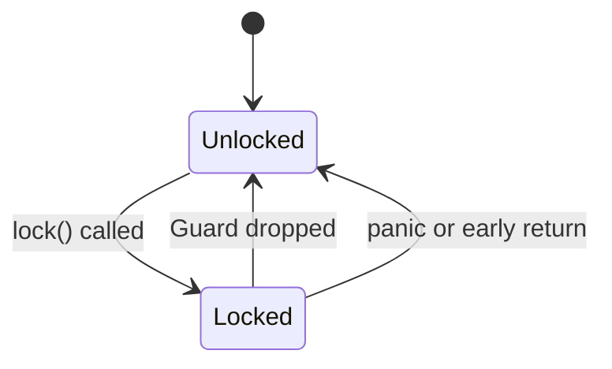
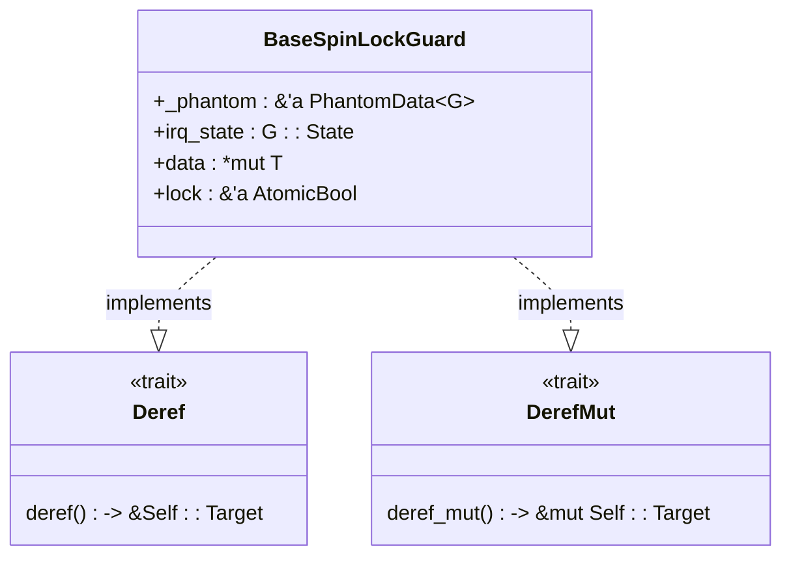
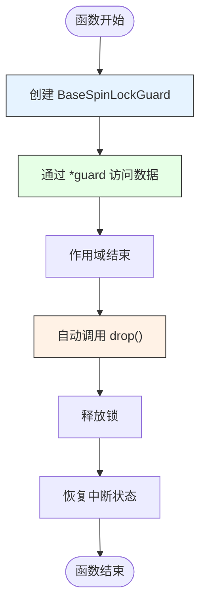

<cite>
**本文档中引用的文件**
- [base.rs](file://src/base.rs)
- [lib.rs](file://src/lib.rs)
</cite>

## 目录
1. [引言](#引言)
2. [核心组件分析](#核心组件分析)
3. [RAII与自动释放机制详解](#raii与自动释放机制详解)
4. [Deref与DerefMut实现透明访问](#deref与derefmut实现透明访问)
5. [Drop方法中的释放顺序保证](#drop方法中的释放顺序保证)
6. [编译器生命周期检查机制](#编译器生命周期检查机制)
7. [结论](#结论)

## 引言

`BaseSpinLockGuard` 是 Rust 内核同步原语中的关键组件，它利用 Rust 的 RAII（Resource Acquisition Is Initialization）范式确保锁的安全管理。该结构体通过在栈上创建守卫对象来自动管理锁的获取与释放，从而避免了手动调用解锁操作可能导致的死锁或资源泄露问题。

本文档将深入分析 `BaseSpinLockGuard` 如何结合 Rust 的所有权系统和 trait 机制，在编译期杜绝内存安全问题，并保证运行时的正确性。

## 核心组件分析

`BaseSpinLockGuard` 作为 `BaseSpinLock` 的配套守卫类型，封装了对共享数据的受保护访问。其设计依赖于泛型参数 `G: BaseGuard` 来决定是否需要禁用中断或内核抢占，适用于单核与多核环境。

该守卫结构体包含指向原始数据的裸指针、中断状态保存字段以及对原子锁的引用（仅在启用 SMP 特性时存在），确保在作用域结束时能够正确恢复系统状态。

**Section sources**
- [base.rs](file://src/base.rs#L80-L95)
- [lib.rs](file://src/lib.rs#L1-L37)

## RAII与自动释放机制详解

Rust 的 RAII 范式通过对象的生命周期自动管理资源。`BaseSpinLockGuard` 正是这一理念的典型应用：当调用 `lock()` 方法成功后，返回一个 `BaseSpinLockGuard` 实例，此时锁已被持有；而一旦该实例离开作用域，其 `Drop` 实现会被自动调用，从而释放锁。

这种机制从根本上消除了忘记释放锁的风险，即使在发生 panic 或提前 return 的情况下也能保证锁的正确释放，极大提升了系统的健壮性。



**Diagram sources**
- [base.rs](file://src/base.rs#L150-L180)
- [base.rs](file://src/base.rs#L218-L228)

## Deref与DerefMut实现透明访问

为了使 `BaseSpinLockGuard` 能够像普通引用一样使用，其实现了 `Deref` 和 `DerefMut` trait。这使得用户可以通过解引用操作符直接访问内部封装的数据，而无需显式调用 getter 方法。

```rust
let mut guard = spinlock.lock();
*guard = new_value; // 通过 DerefMut 修改数据
println!("{}", *guard); // 通过 Deref 读取数据
```

这种透明访问的设计极大地简化了 API 使用，同时保持了类型安全。



**Diagram sources**
- [base.rs](file://src/base.rs#L195-L208)

**Section sources**
- [base.rs](file://src/base.rs#L195-L208)

## Drop方法中的释放顺序保证

`BaseSpinLockGuard` 的 `Drop` 实现严格遵循正确的释放顺序：

```rust
impl<G: BaseGuard, T: ?Sized> Drop for BaseSpinLockGuard<'_, G, T> {
    #[inline(always)]
    fn drop(&mut self) {
        #[cfg(feature = "smp")]
        self.lock.store(false, Ordering::Release);
        G::release(self.irq_state);
    }
}
```

释放顺序为：
1. 首先释放原子锁（仅在 SMP 模式下）
2. 然后恢复中断状态

这个顺序至关重要：如果颠倒顺序，在恢复中断后但尚未释放锁之前，可能引发高优先级中断尝试获取同一把锁而导致死锁。因此，必须先释放锁再恢复中断上下文。

此外，使用 `Ordering::Release` 内存序确保所有之前的写操作对其他 CPU 可见，维护了跨线程的内存一致性。

**Section sources**
- [base.rs](file://src/base.rs#L218-L228)

## 编译器生命周期检查机制

Rust 编译器通过严格的借用检查（borrow checker）和 Drop check 来验证 `BaseSpinLockGuard` 的生命周期正确性。具体表现为：

- 守卫对象持有一个指向锁内数据的可变引用（`*mut T`），该引用的生命周期 `'a` 与守卫本身绑定
- 只要守卫存在，其他代码就无法获得对该数据的任何引用，防止数据竞争
- 编译器确保守卫不会被复制或移动到超出其有效范围的位置
- Drop check 验证所有字段的析构顺序，防止提前释放或双重释放

这些静态检查机制共同作用，使得诸如提前释放、重复释放等错误在编译期就被捕获，无需运行时开销即可保证内存安全。



**Diagram sources**
- [base.rs](file://src/base.rs#L218-L228)

## 结论

`BaseSpinLockGuard` 充分体现了 Rust 在系统编程领域的优势：通过 RAII 范式、trait 实现和编译时检查的有机结合，实现了既高效又安全的锁管理机制。其设计不仅保证了锁的自动释放，还通过精确的释放顺序控制避免了死锁风险，同时借助 `Deref`/`DerefMut` 提供了自然的语法体验。最重要的是，这一切都在零运行时开销的前提下，由编译器静态验证完成，真正做到了“安全且高效”。