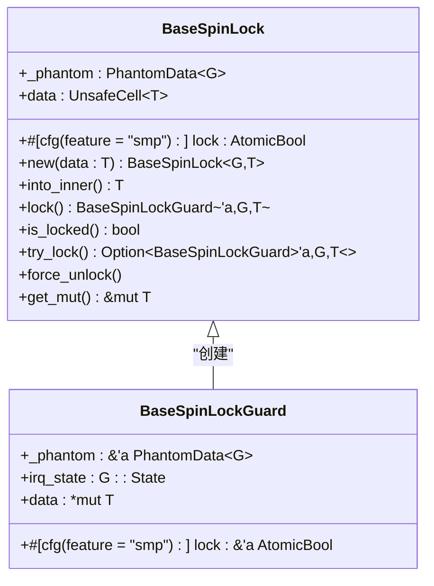
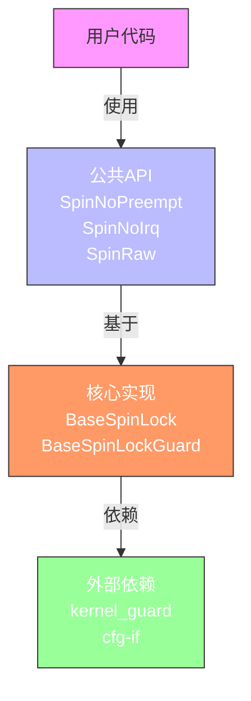

# 模块化结构设计

<cite>
**本文档引用的文件**
- [lib.rs](file://src/lib.rs)
- [base.rs](file://src/base.rs)
- [Cargo.toml](file://Cargo.toml)
- [README.md](file://README.md)
</cite>

## 目录
1. [项目结构概览](#项目结构概览)
2. [公共接口门面：lib.rs的作用](#公共接口门面librs的作用)
3. [核心实现模块：base.rs分析](#核心实现模块baser分析)
4. [模块声明与命名空间](#模块声明与命名空间)
5. [分层设计的优势](#分层设计的优势)
6. [对外暴露的设计理念](#对外暴露的设计理念)

## 项目结构概览

本项目采用典型的Rust库结构，通过清晰的模块划分实现了功能的解耦。根目录包含`Cargo.toml`和`README.md`，源码位于`src/`目录下，由`lib.rs`和`base.rs`两个核心文件构成。

```mermaid
graph TB
subgraph "源码"
lib[lib.rs<br/>公共接口门面]
base[base.rs<br/>核心实现]
end
lib --> base : pub use 导出类型
Cargo[Cargo.toml<br/>元数据与依赖]
README[README.md<br/>文档说明]
lib -.-> Cargo
lib -.-> README
```

**Diagram sources**
- [lib.rs](file://src/lib.rs#L1-L36)
- [base.rs](file://src/base.rs#L1-L437)
- [Cargo.toml](file://Cargo.toml#L1-L22)
- [README.md](file://README.md#L1-L36)

**Section sources**
- [lib.rs](file://src/lib.rs#L1-L36)
- [base.rs](file://src/base.rs#L1-L437)

## 公共接口门面：lib.rs的作用

`lib.rs`作为整个库的入口点，扮演了“公共接口门面”的角色。它不直接包含核心逻辑的实现，而是通过模块系统组织和导出外部可用的API。

其主要职责包括：
1. 声明内部模块`mod base;`
2. 使用`pub use`将`base`模块中的核心类型重新导出
3. 定义基于核心类型的便捷别名（type alias）

这种设计模式遵循了“接口与实现分离”的原则，使得库的使用者无需关心底层实现细节即可使用高级抽象。

```rust
// 在 lib.rs 中，仅通过 pub use 导出必要的类型
pub use self::base::{BaseSpinLock, BaseSpinLockGuard};
```

此外，`lib.rs`还定义了三种具体化的自旋锁类型及其对应的守卫类型，这些是用户最常接触的API：

- `SpinNoPreempt<T>`: 禁用内核抢占的自旋锁
- `SpinNoIrq<T>`: 同时禁用抢占和本地中断的自旋锁
- `SpinRaw<T>`: 原始自旋锁，不进行任何状态修改

这些类型均基于`BaseSpinLock<G, T>`模板构建，通过不同的泛型参数`G`来控制临界区的行为。

**Section sources**
- [lib.rs](file://src/lib.rs#L1-L36)

## 核心实现模块：base.rs分析

`base.rs`文件包含了所有核心功能的实现，是整个库的基石。它定义了两个关键的泛型结构体：

### BaseSpinLock 结构体

`BaseSpinLock<G, T>` 是一个通用的自旋锁实现，其行为由泛型参数`G`决定，该参数必须实现`BaseGuard` trait。这种设计允许在获取锁之前执行特定的操作（如禁用中断或抢占），并在释放锁后恢复原始状态。

在单核环境（无`smp`特性）下，编译器会优化掉锁状态，因为只要遵循正确的守卫使用规则，CPU总能获得锁。而在多核环境下，则使用`AtomicBool`来保证原子性。

### BaseSpinLockGuard 结构体

`BaseSpinLockGuard<'a, G, T>` 是与`BaseSpinLock`配对的守卫类型，实现了RAII（资源获取即初始化）模式。当守卫超出作用域时，析构函数会自动释放锁并恢复中断/抢占状态，确保了异常安全。

该模块还为`BaseSpinLock`实现了`Sync`和`Send`等关键的unsafe trait，以支持跨线程共享。

**Section sources**
- [base.rs](file://src/base.rs#L1-L437)

## 模块声明与命名空间

`lib.rs`文件顶部的`mod base;`声明具有重要的语义：

1. **模块引入**：它告诉Rust编译器在当前路径下存在一个名为`base`的模块，其内容位于同级的`base.rs`文件中。
2. **私有性**：默认情况下，通过`mod`声明引入的模块是私有的，这意味着外部代码无法直接访问`base`模块。
3. **命名空间隔离**：`base`模块内的所有项都位于`self::base::`命名空间下，避免了全局命名污染。

正是由于`mod base;`的私有性，才需要通过`pub use`将`BaseSpinLock`和`BaseSpinLockGuard`显式地重新导出到公共接口中。这提供了一层额外的控制，开发者可以精确选择哪些内部类型应该对外暴露。



**Diagram sources**
- [base.rs](file://src/base.rs#L15-L100)

**Section sources**
- [base.rs](file://src/base.rs#L15-L100)
- [lib.rs](file://src/lib.rs#L5-L7)

## 分层设计的优势

这种将接口与实现分离的分层设计带来了显著的优势：

### 提升可维护性

- **实现变更透明**：`base.rs`中的核心算法可以独立演进，只要保持`BaseSpinLock`和`BaseSpinLockGuard`的API不变，就不会影响到`lib.rs`或外部使用者。
- **关注点分离**：`lib.rs`专注于API设计和用户体验，而`base.rs`专注于并发原语的正确性和性能。

### 便于未来扩展

- **新增锁类型简单**：要添加一种新的自旋锁变体，只需在`lib.rs`中定义一个新的type alias，指向`BaseSpinLock<NewGuard, T>`，无需修改核心逻辑。
- **特性开关友好**：通过`cfg(feature = "smp")`等条件编译指令，可以在不同环境下启用或禁用特定功能，而不会影响整体架构。

### 编译优化

- **零成本抽象**：Rust的泛型和内联机制确保了这些抽象在编译后几乎不产生运行时开销。
- **死代码消除**：未使用的具体化类型（如用户只用了`SpinRaw`而没用`SpinNoIrq`）会被链接器移除，减小最终二进制体积。

**Section sources**
- [lib.rs](file://src/lib.rs#L1-L36)
- [base.rs](file://src/base.rs#L1-L437)

## 对外暴露的设计理念

本库在设计上严格遵循“最小化对外暴露”的原则：

1. **隐藏实现细节**：`base`模块本身不被导出，外部无法直接访问`mod base;`。所有交互都必须通过`lib.rs`提供的公共API进行。
2. **精确控制导出**：仅通过`pub use`导出了两个核心类型`BaseSpinLock`和`BaseSpinLockGuard`，其他辅助结构或测试代码均保持私有。
3. **提供高层抽象**：虽然核心是泛型的`BaseSpinLock`，但向用户推荐的是`SpinNoPreempt`、`SpinNoIrq`等具体类型，降低了使用门槛。

这种设计理念确保了库的稳定性——未来的内部重构不会破坏用户的代码，同时也为库的维护者提供了灵活的演进空间。



**Diagram sources**
- [lib.rs](file://src/lib.rs#L1-L36)
- [base.rs](file://src/base.rs#L1-L437)

**Section sources**
- [lib.rs](file://src/lib.rs#L1-L36)
- [base.rs](file://src/base.rs#L1-L437)