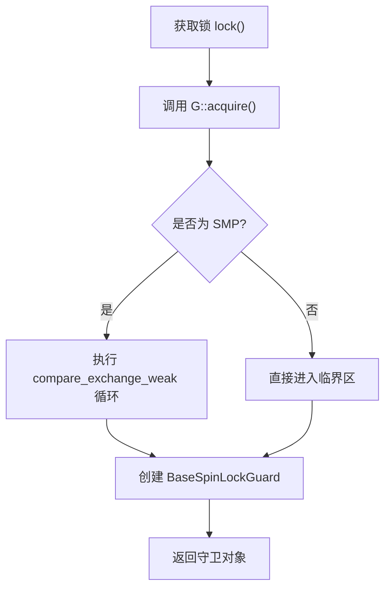

# 泛型策略模式应用

<cite>
**本文档中引用的文件**  
- [base.rs](file://src/base.rs)
- [lib.rs](file://src/lib.rs)
- [Cargo.toml](file://Cargo.toml)
- [README.md](file://README.md)
</cite>

## 目录
1. [引言](#引言)  
2. [核心设计原理](#核心设计原理)  
3. [G参数与BaseGuard约束机制](#g参数与baseguard约束机制)  
4. [策略注入与kernel_guard依赖](#策略注入与kernel_guard依赖)  
5. [具体锁类型适配分析](#具体锁类型适配分析)  
6. [自定义Guard实现示例](#自定义guard实现示例)  
7. [编译时优化与灵活性优势](#编译时优化与灵活性优势)  
8. [总结](#总结)

## 引言

`BaseSpinLock<T, G>` 是一个为内核空间设计的自旋锁基础结构，其核心创新在于通过泛型参数 `G` 实现中断和抢占控制逻辑的外部化。该设计允许同一锁结构适配不同的守卫行为（如 `NoPreempt`、`NoPreemptIrqSave`），从而在不同上下文中提供精确的同步保障。本文深入解析 `G` 参数的设计原理，阐述其如何通过 `BaseGuard` 约束实现策略注入，并讨论此模式带来的灵活性与性能优势。

**Section sources**  
- [base.rs](file://src/base.rs#L0-L42)  
- [README.md](file://README.md#L0-L35)

## 核心设计原理

`BaseSpinLock` 的设计遵循“关注点分离”原则，将锁的核心互斥逻辑与平台相关的中断/抢占控制逻辑解耦。锁本身仅负责在多核环境下管理原子状态（`AtomicBool`），而何时以及如何禁用中断或抢占，则完全由泛型参数 `G` 所代表的策略决定。这种设计使得锁的实现保持简洁，同时具备极高的可扩展性。



**Diagram sources**  
- [base.rs](file://src/base.rs#L70-L100)

**Section sources**  
- [base.rs](file://src/base.rs#L0-L42)

## G参数与BaseGuard约束机制

泛型参数 `G` 通过 `G: BaseGuard` 这一 trait bound 进行约束。`BaseGuard` 定义了两个关键的静态方法：`acquire()` 和 `release()`，分别在获取锁和释放锁时被调用。

- **`acquire()`**: 在尝试获取锁之前调用，用于保存当前中断/抢占状态并执行相应的禁用操作。
- **`release(state)`**: 在锁被释放时调用，接收 `acquire()` 返回的状态，用于恢复之前的中断/抢占状态。

这种机制将中断/抢占的控制权完全交给了 `G` 类型的实现，实现了逻辑的外部化。`BaseSpinLock` 本身无需了解任何关于中断或抢占的具体细节，只需按约定调用这两个方法即可。

```mermaid
sequenceDiagram
participant Lock as BaseSpinLock
participant Guard as G (BaseGuard)
participant Critical as 临界区代码
Lock->>Guard : G : : acquire()
alt 获取成功
Lock->>Lock : 执行原子操作(仅SMP)
Lock->>Critical : 返回 BaseSpinLockGuard
Critical->>Lock : guard 被 drop
Lock->>Guard : G : : release(state)
else 获取失败
Lock->>Guard : G : : release(state)
Lock->>Lock : 返回 None
end
```

**Diagram sources**  
- [base.rs](file://src/base.rs#L70-L100)  
- [base.rs](file://src/base.rs#L218-L275)

**Section sources**  
- [base.rs](file://src/base.rs#L70-L100)  
- [base.rs](file://src/base.rs#L218-L275)

## 策略注入与kernel_guard依赖

`kernel_guard` 库提供了具体的 `BaseGuard` 实现，作为策略注入的载体。`BaseSpinLock` 通过依赖 `kernel_guard`，获得了多种预定义的行为：

- **`NoOp`**: 不执行任何操作，适用于已处于安全上下文（如中断禁用）的场景。
- **`NoPreempt`**: 禁用内核抢占，确保当前任务不会被调度器切换。
- **`NoPreemptIrqSave`**: 同时禁用抢占和本地中断，并保存中断状态。

这些类型作为 `G` 的具体实例，被“注入”到 `BaseSpinLock` 中，从而生成具有特定行为的锁类型。例如，`SpinNoIrq<T>` 就是 `BaseSpinLock<NoPreemptIrqSave, T>` 的别名，它自动继承了禁用中断和抢占的能力。

**Section sources**  
- [lib.rs](file://src/lib.rs#L0-L35)  
- [Cargo.toml](file://Cargo.toml#L0-L20)

## 具体锁类型适配分析

通过 `type alias`，库暴露了三种常用的锁类型，它们都基于 `BaseSpinLock`，但使用了不同的 `G` 策略：

| 锁类型 | G 参数 | 行为描述 | 使用场景 |
| :--- | :--- | :--- | :--- |
| `SpinRaw<T>` | `NoOp` | 不进行任何中断或抢占控制 | 已知处于禁用中断和抢占的上下文 |
| `SpinNoPreempt<T>` | `NoPreempt` | 仅禁用内核抢占 | 需要防止任务切换，但可以处理中断 |
| `SpinNoIrq<T>` | `NoPreemptIrqSave` | 同时禁用抢占和本地中断 | 需要最高级别保护的临界区 |

这种设计极大地简化了用户的使用。开发者可以根据上下文需求选择最合适的锁类型，而无需关心底层复杂的同步原语。

**Section sources**  
- [lib.rs](file://src/lib.rs#L14-L35)  
- [README.md](file://README.md#L13-L35)

## 自定义Guard实现示例

`BaseGuard` trait 的开放性允许用户定义自己的策略。以下是一个测试用的 `TestGuardIrq` 实现，它通过一个全局计数器来模拟中断状态的增减：

```rust
struct TestGuardIrq;

static mut IRQ_CNT: u32 = 0;
impl BaseGuard for TestGuardIrq {
    type State = u32;
    fn acquire() -> Self::State {
        unsafe {
            IRQ_CNT += 1;
            IRQ_CNT
        }
    }

    fn release(_: Self::State) {
        unsafe {
            IRQ_CNT -= 1;
        }
    }
}

type TestSpinIrq<T> = BaseSpinLock<TestGuardIrq, T>;
```

这个例子证明了 `BaseSpinLock` 的通用性。只要实现了 `BaseGuard` trait，任何类型都可以作为 `G` 参数，从而定制锁的行为。这为未来的功能扩展（如支持更精细的锁定粒度或调试信息收集）提供了可能性。

**Section sources**  
- [base.rs](file://src/base.rs#L218-L275)

## 编译时优化与灵活性优势

此设计带来了显著的优势：

1.  **零成本抽象**: 由于所有逻辑都在编译时确定，`G` 的调用会被内联，最终生成的代码与手写的一样高效。对于单核环境（无 `smp` feature），锁状态甚至会被完全优化掉。
2.  **极致的灵活性**: 通过组合不同的 `G` 策略，可以轻松创建满足各种需求的锁，而无需复制锁的核心逻辑。
3.  **清晰的职责划分**: 锁的实现者专注于互斥逻辑，而策略的实现者（如 `kernel_guard`）专注于平台相关的低级操作，两者解耦，降低了维护复杂度。
4.  **易于测试**: 如 `TestGuardIrq` 所示，可以通过模拟策略来测试锁的行为，而无需依赖真实的硬件中断。

总而言之，`BaseSpinLock<T, G>` 通过泛型策略模式，成功地将不变的锁逻辑与可变的平台策略分离，是 Rust 中利用类型系统实现高性能、高灵活性系统编程的一个典范。

**Section sources**  
- [base.rs](file://src/base.rs#L102-L135)  
- [base.rs](file://src/base.rs#L137-L175)

## 总结

`BaseSpinLock<T, G>` 的设计精髓在于利用泛型和 trait bound 将中断/抢占控制这一横切关注点外部化。通过 `G: BaseGuard` 约束，它实现了策略的灵活注入，使得单一的锁结构能够适应 `NoPreempt`、`NoPreemptIrqSave` 等多种行为。结合 `kernel_guard` 提供的具体实现，该设计不仅保证了运行时的零成本，还提供了卓越的代码复用性和可扩展性，充分体现了泛型编程在系统级软件开发中的强大威力。