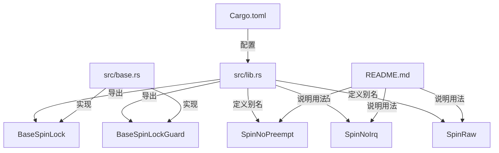
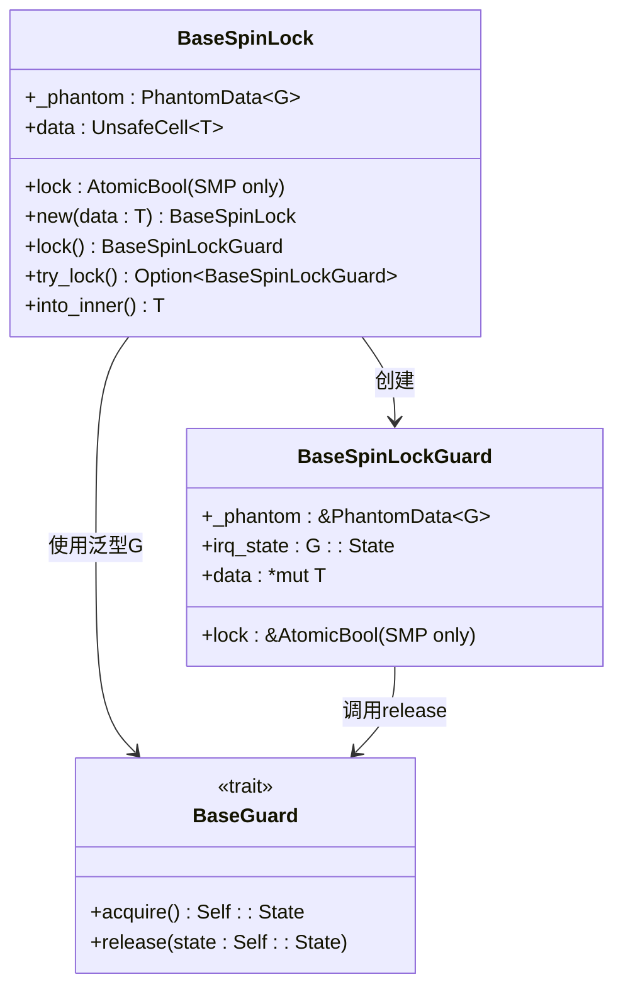
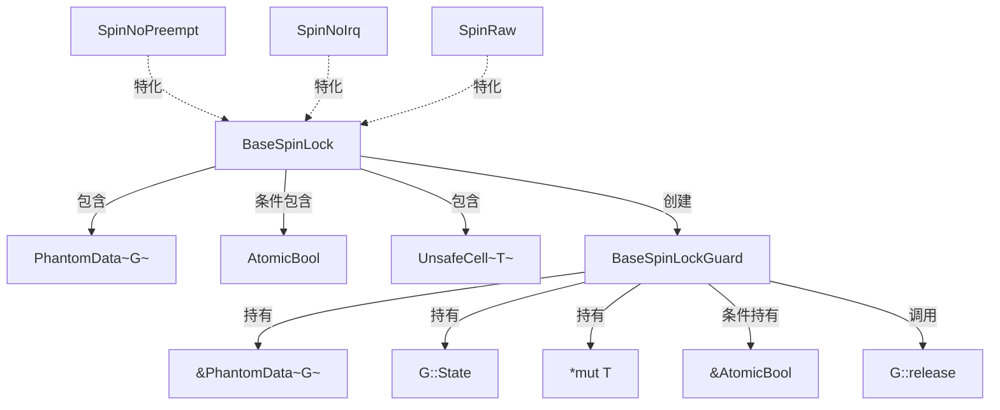

# 设计原理

<cite>
**本文档引用的文件**  
- [lib.rs](file://src/lib.rs)
- [base.rs](file://src/base.rs)
- [Cargo.toml](file://Cargo.toml)
- [README.md](file://README.md)
</cite>

## 目录
1. [项目结构](#项目结构)  
2. [核心组件分析](#核心组件分析)  
3. [架构概述](#架构概述)  
4. [泛型策略模式与锁行为解耦](#泛型策略模式与锁行为解耦)  
5. [RAII与Drop机制确保锁安全释放](#raii与drop机制确保锁安全释放)  
6. [数据存储设计：UnsafeCell vs RefCell](#数据存储设计unsafe_cell-vs-refcell)  
7. [SMP场景下的内存顺序要求](#smp场景下的内存顺序要求)  
8. [PhantomData在生命周期标记中的作用](#phantomdata在生命周期标记中的作用)  
9. [组件关系图](#组件关系图)  
10. [设计权衡总结](#设计权衡总结)

## 项目结构

kspin库采用模块化设计，主要由两个源文件构成：`lib.rs`作为公共接口层，负责暴露类型别名和关键结构；`base.rs`封装了核心逻辑，实现基础自旋锁及其守卫机制。通过条件编译（`cfg(feature = "smp")`）优化单核与多核环境下的性能表现。



**Diagram sources**  
- [lib.rs](file://src/lib.rs#L1-L35)
- [base.rs](file://src/base.rs#L1-L42)
- [Cargo.toml](file://Cargo.toml#L1-L22)
- [README.md](file://README.md#L1-L35)

**Section sources**  
- [lib.rs](file://src/lib.rs#L1-L35)
- [base.rs](file://src/base.rs#L1-L42)

## 核心组件分析

kspin的核心是`BaseSpinLock<G, T>`和`BaseSpinLockGuard<'a, G, T>`两个泛型结构体。前者用于保护共享数据，后者作为RAII守卫，在作用域结束时自动释放锁。该设计通过泛型参数`G`实现锁定策略的可插拔性，支持不同内核环境下的中断与抢占控制。

**Section sources**  
- [base.rs](file://src/base.rs#L25-L42)

## 架构概述

kspin的整体架构基于策略模式，将锁的同步机制与平台相关的临界区保护行为分离。`BaseSpinLock`依赖于`kernel_guard`库提供的`BaseGuard` trait来管理CPU状态（如禁用中断或抢占），从而实现灵活适配。



**Diagram sources**  
- [base.rs](file://src/base.rs#L25-L42)
- [base.rs](file://src/base.rs#L44-L68)
- [base.rs](file://src/base.rs#L70-L100)

**Section sources**  
- [base.rs](file://src/base.rs#L25-L100)

## 泛型策略模式与锁行为解耦

`BaseSpinLock<G, T>`利用泛型参数`G`实现策略模式，其中`G`必须实现`BaseGuard` trait。这种设计使得锁定行为（如是否禁用中断）与数据保护机制完全解耦：

- `SpinRaw<T>` 使用 `NoOp` 策略，不进行任何状态修改。
- `SpinNoPreempt<T>` 使用 `NoPreempt` 策略，在加锁时禁用内核抢占。
- `SpinNoIrq<T>` 使用 `NoPreemptIrqSave` 策略，同时禁用抢占和本地中断。

通过替换`G`参数，可在不同内核环境中复用同一套锁逻辑，极大提升了代码的可维护性和适应性。

**Section sources**  
- [lib.rs](file://src/lib.rs#L8-L35)
- [base.rs](file://src/base.rs#L25-L42)

## RAII与Drop机制确保锁安全释放

kspin严格遵循RAII原则，通过`BaseSpinLockGuard`的`Drop`实现在作用域结束时自动释放锁：

```rust
impl<G: BaseGuard, T: ?Sized> Drop for BaseSpinLockGuard<'_, G, T> {
    #[inline(always)]
    fn drop(&mut self) {
        #[cfg(feature = "smp")]
        self.lock.store(false, Ordering::Release);
        G::release(self.irq_state);
    }
}
```

此机制从根本上杜绝了死锁风险——即使发生panic或提前return，Rust运行时也会调用`Drop::drop`，确保锁被正确释放且中断/抢占状态恢复。测试用例`test_irq_lock_restored`验证了这一行为的正确性。

**Section sources**  
- [base.rs](file://src/base.rs#L218-L243)
- [base.rs](file://src/base.rs#L331-L337)

## 数据存储设计：UnsafeCell vs RefCell

kspin选择`UnsafeCell<T>`而非`RefCell<T>`来存储受保护的数据，原因如下：

1. **零运行时开销**：`UnsafeCell`仅提供编译期的可变性抽象，无借用检查的运行时成本。
2. **适用于内核空间**：`RefCell`的动态借用检查可能引发panic，不适合高可靠性系统编程。
3. **手动内存安全保证**：通过`Deref`和`DerefMut`的`unsafe`块，开发者明确承担内存安全责任，符合底层系统编程范式。

所有对`data`字段的访问均通过`unsafe`指针操作完成，但其安全性由锁机制本身保障。

**Section sources**  
- [base.rs](file://src/base.rs#L30-L31)
- [base.rs](file://src/base.rs#L54-L55)
- [base.rs](file://src/base.rs#L96-L97)
- [base.rs](file://src/base.rs#L141-L142)

## SMP场景下的内存顺序要求

在多核（SMP）环境下，`AtomicBool`用于表示锁状态，其内存顺序的选择至关重要：

- **获取锁时**：使用`Ordering::Acquire`确保后续读写不会被重排序到锁获取之前。
- **释放锁时**：使用`Ordering::Release`确保之前的读写不会被重排序到锁释放之后。
- **弱比较交换**：`compare_exchange_weak`允许虚假失败，配合循环使用以提高性能。
- **自旋提示**：`core::hint::spin_loop()`提示CPU进入忙等待状态，减少功耗。

这些内存顺序约束共同保证了跨核缓存一致性与操作的原子性。

**Section sources**  
- [base.rs](file://src/base.rs#L13-L14)
- [base.rs](file://src/base.rs#L29-L30)
- [base.rs](file://src/base.rs#L75-L79)
- [base.rs](file://src/base.rs#L220-L221)

## PhantomData在生命周期标记中的作用

`PhantomData<G>`在`BaseSpinLock`和`BaseSpinLockGuard`中起到两个关键作用：

1. **类型占位符**：告知编译器`BaseSpinLock`拥有对`G`类型的“所有权”，影响`Send/Sync`等自动trait的推导。
2. **生命周期协变**：`BaseSpinLockGuard`中的`&'a PhantomData<G>`确保守卫的生命周期与锁类型相关联，防止跨类型误用。

尽管`_phantom`字段不占用实际内存，但它在类型系统层面提供了必要的语义信息。

**Section sources**  
- [base.rs](file://src/base.rs#L7-L9)
- [base.rs](file://src/base.rs#L27-L28)
- [base.rs](file://src/base.rs#L37-L38)

## 组件关系图

以下Mermaid图示展示了kspin核心组件之间的关系：



**Diagram sources**  
- [base.rs](file://src/base.rs#L25-L42)
- [lib.rs](file://src/lib.rs#L8-L35)

## 设计权衡总结

kspin的设计体现了以下核心权衡：

| 权衡维度 | 选择 | 原因 |
|--------|------|------|
| 性能 vs 抽象层次 | 性能优先 | 避免虚函数调用，使用泛型静态分发 |
| 安全性 vs 灵活性 | 安全性优先 | RAII+Drop确保锁必然释放 |
| 通用性 vs 特化 | 条件编译优化 | 单核环境移除原子变量开销 |
| 运行时检查 vs 编译时保证 | 编译时为主 | 使用`unsafe`但由锁机制担保安全 |

总体而言，kspin在保证绝对安全的前提下，追求最小化运行时开销，专为操作系统内核等高性能、高可靠场景设计。

**Section sources**  
- [base.rs](file://src/base.rs#L1-L437)
- [lib.rs](file://src/lib.rs#L1-L35)
- [Cargo.toml](file://Cargo