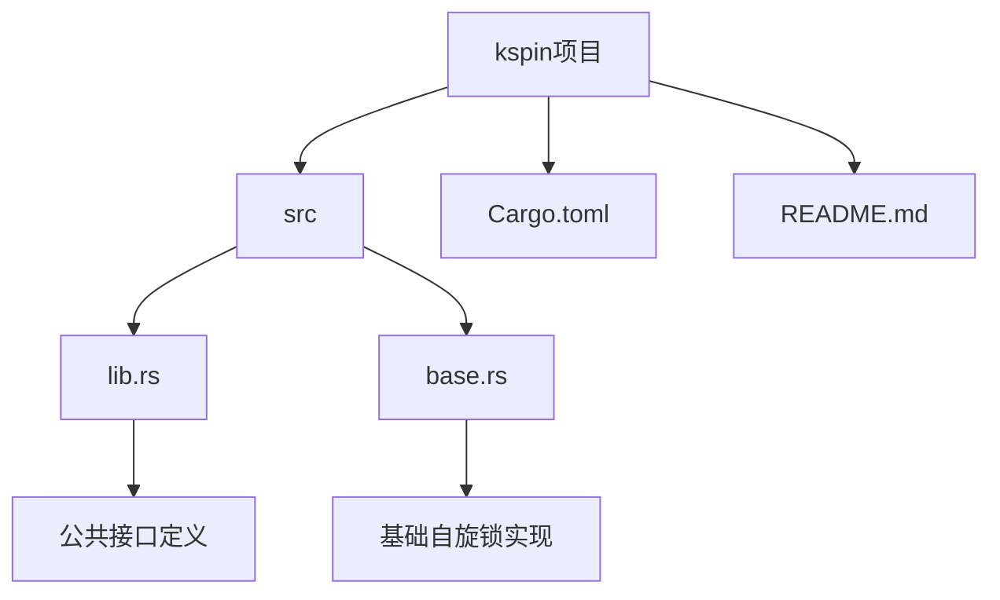
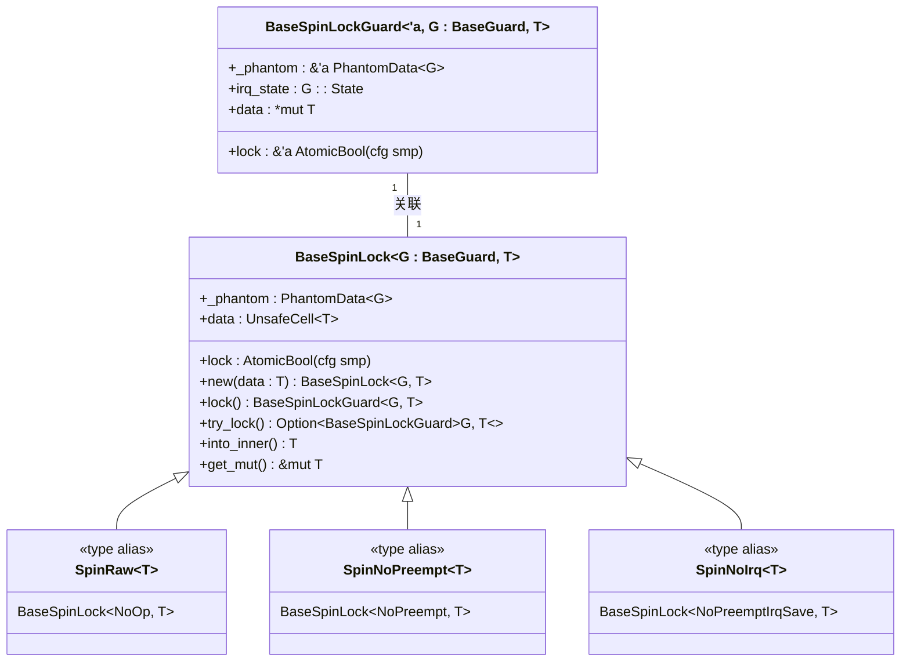
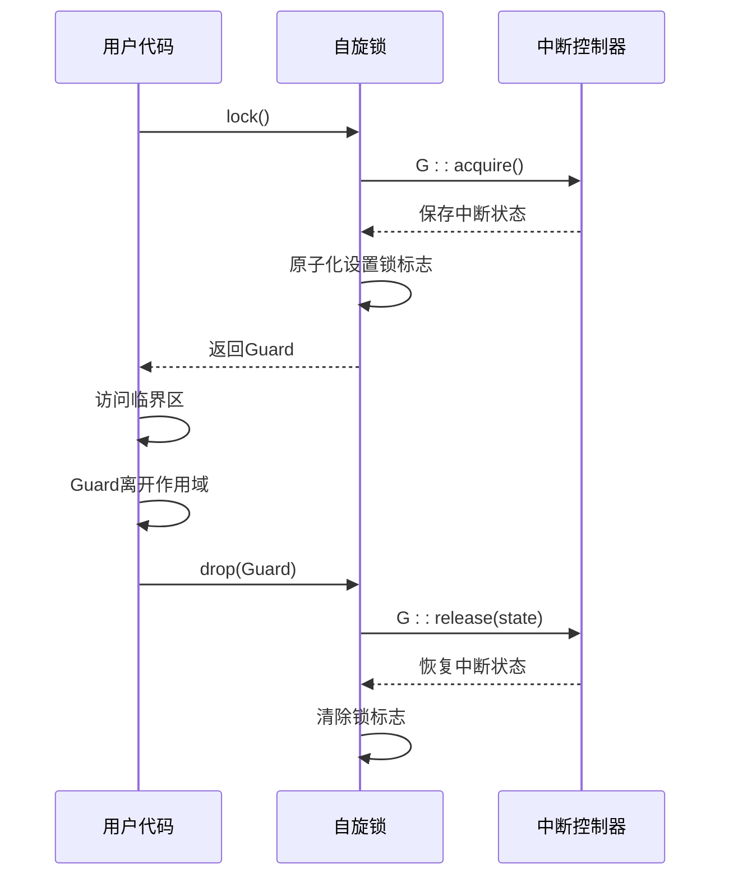

# 项目概述

<cite>
**本文档中引用的文件**
- [README.md](file://README.md)
- [Cargo.toml](file://Cargo.toml)
- [src/lib.rs](file://src/lib.rs)
- [src/base.rs](file://src/base.rs)
</cite>

## 目录
1. [简介](#简介)
2. [项目结构](#项目结构)
3. [核心功能与设计目标](#核心功能与设计目标)
4. [架构分析](#架构分析)
5. [自旋锁类型详解](#自旋锁类型详解)
6. [守卫模式与RAII机制](#守卫模式与raii机制)
7. [条件编译与单核/多核优化](#条件编译与单核多核优化)
8. [原子操作与数据封装](#原子操作与数据封装)
9. [典型使用场景](#典型使用场景)
10. [依赖关系说明](#依赖关系说明)

## 简介
kspin 是一个专为内核空间设计的轻量级自旋锁库，旨在提供高性能的同步原语，适用于操作系统内核开发中的临界区保护。该项目通过结合自旋锁机制与中断/抢占控制，确保在并发访问共享资源时的数据一致性。其设计兼顾了单核与多核环境下的性能优化，并利用Rust语言的安全特性实现无畏并发编程。

## 项目结构
本项目采用典型的Rust库结构，包含源码、配置文件和文档三大部分：



**Diagram sources**
- [src/lib.rs](file://src/lib.rs#L1-L35)
- [src/base.rs](file://src/base.rs#L1-L42)

**Section sources**
- [src/lib.rs](file://src/lib.rs#L1-L35)
- [src/base.rs](file://src/base.rs#L1-L42)

## 核心功能与设计目标
kspin的核心功能是提供可在内核空间使用的自旋锁，能够在进入临界区时选择性地禁用抢占或中断请求（IRQs），从而防止上下文切换或中断处理程序对共享资源的干扰。该库的设计目标包括：
- **轻量化**：最小化运行时开销，避免不必要的系统调用。
- **高性能**：在单核环境下消除锁状态检查，在多核环境下使用高效的原子操作。
- **安全性**：利用Rust的所有权和生命周期机制防止死锁和资源泄漏。
- **灵活性**：支持多种锁定策略以适应不同的内核编程场景。

**Section sources**
- [README.md](file://README.md#L1-L12)
- [src/base.rs](file://src/base.rs#L1-L10)

## 架构分析
kspin的整体架构基于泛型编程和组合模式构建，主要由`BaseSpinLock`作为底层实现，上层通过类型别名封装出不同行为的自旋锁变体。



**Diagram sources**
- [src/base.rs](file://src/base.rs#L44-L42)
- [src/lib.rs](file://src/lib.rs#L15-L35)

**Section sources**
- [src/base.rs](file://src/base.rs#L44-L42)
- [src/lib.rs](file://src/lib.rs#L15-L35)

## 自旋锁类型详解
kspin提供了三种预定义的自旋锁类型，分别对应不同的中断管理策略：

| 锁类型 | 行为描述 | 使用场景 |
|--------|---------|----------|
| `SpinRaw<T>` | 不进行任何中断或抢占控制，仅提供基本互斥 | 已处于禁止抢占和中断的上下文中 |
| `SpinNoPreempt<T>` | 在加锁期间禁用内核抢占 | 可能被其他线程抢占但无需处理中断的场景 |
| `SpinNoIrq<T>` | 在加锁期间同时禁用抢占和本地中断 | 需要完全隔离中断影响的关键临界区 |

这些类型均通过`BaseSpinLock`与`kernel_guard`提供的守卫类型组合而成，实现了关注点分离的设计原则。

**Section sources**
- [src/lib.rs](file://src/lib.rs#L15-L35)
- [README.md](file://README.md#L13-L35)

## 守卫模式与RAII机制
kspin采用RAII（Resource Acquisition Is Initialization）模式管理锁的生命周期。当调用`.lock()`方法时，返回一个`BaseSpinLockGuard`类型的守卫对象，该对象在创建时获取锁并执行相应的中断控制操作，在析构时自动释放锁并恢复之前的中断状态。



**Diagram sources**
- [src/base.rs](file://src/base.rs#L70-L100)
- [src/base.rs](file://src/base.rs#L218-L225)

**Section sources**
- [src/base.rs](file://src/base.rs#L70-L100)
- [src/base.rs](file://src/base.rs#L218-L225)

## 条件编译与单核/多核优化
kspin通过Cargo特性（feature）`smp`实现对单核与多核环境的差异化支持。在未启用`smp`特性时，系统假定为单核环境，此时锁的状态变量被优化移除，CPU可直接获得锁，从而消除不必要的原子操作开销。

```mermaid
flowchart TD
    Start([开始加锁]) --> CheckSMP{是否启用SMP特性?}
    CheckSMP -->|是| MultiCore[执行原子比较交换]
    CheckSMP -->|否| SingleCore[直接获取锁]
    MultiCore --> WaitLoop{是否已锁定?}
    WaitLoop -->|是| SpinWait[core::hint::spin_loop()]
    WaitLoop -->|否| Ac